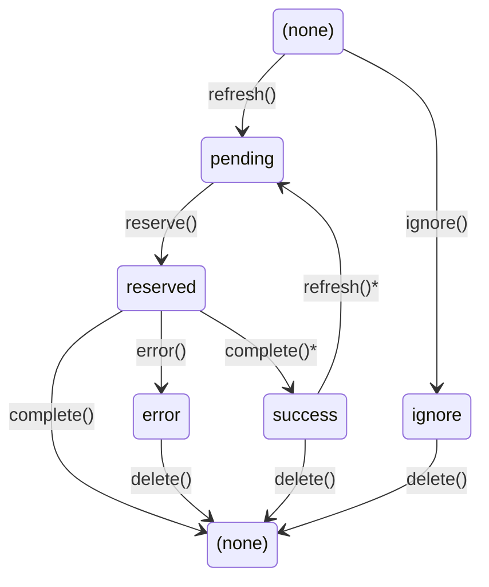

# Autopopulate 2.0 Specification

## Overview

This specification redesigns the DataJoint job handling system to provide better visibility, control, and scalability for distributed computing workflows. The new system replaces the schema-level `~jobs` table with per-table job tables that offer richer status tracking, proper referential integrity, and dashboard-friendly monitoring.

## Problem Statement

### Current Jobs Table Limitations

The existing `~jobs` table has significant limitations:

1. **Limited status tracking**: Only supports `reserved`, `error`, and `ignore` statuses
2. **Functions as an error log**: Cannot efficiently track pending or completed jobs
3. **Poor dashboard visibility**: No way to monitor pipeline progress without querying multiple tables
4. **Key hashing obscures data**: Primary keys are stored as hashes, making debugging difficult
5. **No referential integrity**: Jobs table is independent of computed tables; orphaned jobs can accumulate

### Key Source Limitations

1. **Frequent manual modifications**: Subset operations require modifying `key_source` property
2. **Local visibility only**: Custom key sources are not accessible database-wide
3. **Performance bottleneck**: Multiple workers querying `key_source` simultaneously creates contention
4. **Codebase dependency**: Requires full pipeline codebase to determine pending work

## Proposed Solution

### Terminology

- **Stale job**: A job (any status) whose key no longer exists in `key_source`. The upstream records have been deleted. Stale jobs are cleaned up by `refresh()` based on the `stale_timeout` parameter.

- **Orphaned job**: A `reserved` job whose worker is no longer running. The process that reserved the job crashed, was terminated, or lost connection. The job remains `reserved` indefinitely. Orphaned jobs can be cleaned up by `refresh(orphan_timeout=...)` or manually deleted.

- **Completed job**: A job with status `success`. Only exists when `keep_completed=True`. Represents historical record of successful computation.

### Core Design Principles

1. **Per-table jobs**: Each computed table gets its own hidden jobs table
2. **FK-only primary keys**: Auto-populated tables must have primary keys composed entirely of foreign key references. Non-FK primary key attributes are prohibited in new tables (legacy tables are supported with degraded granularity)
3. **No FK constraints on jobs**: Jobs tables omit foreign key constraints for performance; stale jobs are cleaned by `refresh()`
4. **Rich status tracking**: Extended status values for full lifecycle visibility
5. **Automatic refresh**: `populate()` automatically refreshes the jobs queue (adding new jobs, removing stale ones)
6. **Backward compatible**: When `reserve_jobs=False` (default), 1.0 behavior is preserved

## Architecture

### Jobs Table Structure

Each `dj.Imported` or `dj.Computed` table `MyTable` will have an associated hidden jobs table `~~my_table` with the following structure:

```
# Job queue for MyTable
subject_id : int
session_id : int
...                           # Only FK-derived primary key attributes (NO foreign key constraints)
---
status          : enum('pending', 'reserved', 'success', 'error', 'ignore')
priority        : uint8       # Lower = more urgent (0 = highest), set by refresh()
created_time=CURRENT_TIMESTAMP : timestamp  # When job was added to queue
scheduled_time=CURRENT_TIMESTAMP : timestamp  # Process on or after this time
reserved_time=null  : timestamp  # When job was reserved
completed_time=null : timestamp  # When job completed
duration=null   : float64     # Execution duration in seconds
error_message="" : varchar(2047)  # Truncated error message
error_stack=null : <blob>     # Full error traceback
user=""         : varchar(255)   # Database user who reserved/completed job
host=""         : varchar(255)   # Hostname of worker
pid=0           : uint32      # Process ID of worker
connection_id=0 : uint64      # MySQL connection ID
version=""      : varchar(255)   # Code version (git hash, package version, etc.)
```

**Important**: The jobs table primary key includes only those attributes that come through foreign keys in the target table's primary key. Additional primary key attributes (if any) are excluded. This means:
- If a target table has primary key `(-> Subject, -> Session, method)`, the jobs table has primary key `(subject_id, session_id)` only
- Multiple target rows may map to a single job entry when additional PK attributes exist
- Jobs tables have **no foreign key constraints** for performance (stale jobs handled by `refresh()`)

### Access Pattern

Jobs are accessed as a property of the computed table:

```python
# Current pattern (schema-level)
schema.jobs

# New pattern (per-table)
MyTable.jobs

# Examples
FilteredImage.jobs                    # Access jobs table
FilteredImage.jobs & 'status="error"' # Query errors
FilteredImage.jobs.refresh()          # Refresh job queue
```

### Status Values

| Status | Description |
|--------|-------------|
| `pending` | Job is queued and ready to be processed |
| `reserved` | Job is currently being processed by a worker |
| `success` | Job completed successfully (optional, depends on settings) |
| `error` | Job failed with an error |
| `ignore` | Job should be skipped (manually set, not part of automatic transitions) |

### Status Transitions



- `complete()` deletes the job entry (default when `jobs.keep_completed=False`)
- `complete()*` keeps the job as `success` (when `jobs.keep_completed=True`)
- `refresh()*` re-pends a `success` job if its key is in `key_source` but not in target

**Transition methods:**
- `refresh()` — Adds new jobs as `pending`; also re-pends `success` jobs if key is in `key_source` but not in target
- `ignore()` — Marks a key as `ignore` (can be called on keys not yet in jobs table)
- `reserve()` — Marks a pending job as `reserved` before calling `make()`
- `complete()` — Marks reserved job as `success`, or deletes it (based on `jobs.keep_completed` setting)
- `error()` — Marks reserved job as `error` with message and stack trace
- `delete()` — Inherited from `delete_quick()`; use `(jobs & condition).delete()` pattern

**Manual status control:**
- `ignore` is set manually via `jobs.ignore(key)` and is not part of automatic transitions
- Jobs with `status='ignore'` are skipped by `populate()` and `refresh()`
- To reset an ignored job, delete it and call `refresh()`: `jobs.ignored.delete(); jobs.refresh()`

## API Design

### JobsTable Class

```python
class JobsTable(Table):
    """Hidden table managing job queue for a computed table."""

    @property
    def definition(self) -> str:
        """Dynamically generated based on parent table's primary key."""
        ...

    def refresh(
        self,
        *restrictions,
        delay: float = 0,
        priority: int = None,
        stale_timeout: float = None,
        orphan_timeout: float = None
    ) -> dict:
        """
        Refresh the jobs queue: add new jobs and clean up stale/orphaned jobs.

        Operations performed:
        1. Add new jobs: (key_source & restrictions) - target - jobs → insert as 'pending'
        2. Re-pend success jobs: if keep_completed=True and key in key_source but not in target
        3. Remove stale jobs: jobs older than stale_timeout whose keys no longer in key_source
        4. Remove orphaned jobs: reserved jobs older than orphan_timeout (if specified)

        Args:
            restrictions: Conditions to filter key_source (for adding new jobs)
            delay: Seconds from now until new jobs become available for processing.
                   Default: 0 (immediately available). Uses database server time.
            priority: Priority for new jobs (lower = more urgent).
                      Default from config: jobs.default_priority (5)
            stale_timeout: Seconds after which jobs are checked for staleness.
                          Jobs older than this are removed if key not in key_source.
                          Default from config: jobs.stale_timeout (3600s)
                          Set to 0 to skip stale cleanup.
            orphan_timeout: Seconds after which reserved jobs are considered orphaned.
                           Reserved jobs older than this are deleted and re-added as pending.
                           Default: None (no orphan cleanup - must be explicit).
                           Typical value: 3600 (1 hour) or based on expected job duration.

        Returns:
            {
                'added': int,      # New pending jobs added
                'removed': int,    # Stale jobs removed
                'orphaned': int,   # Orphaned jobs reset to pending
                're_pended': int   # Success jobs re-pended (keep_completed mode)
            }
        """
        ...

    def reserve(self, key: dict) -> bool:
        """
        Attempt to reserve a job for processing.

        Updates status to 'reserved' if currently 'pending' and scheduled_time <= now.
        No locking is used; rare conflicts are resolved by the make() transaction.

        Returns:
            True if reservation successful, False if job not found or not pending.
        """
        ...

    def complete(self, key: dict, duration: float = None) -> None:
        """
        Mark a job as successfully completed.

        Updates status to 'success', records duration and completion time.
        """
        ...

    def error(self, key: dict, error_message: str, error_stack: str = None) -> None:
        """
        Mark a job as failed with error details.

        Updates status to 'error', records error message and stack trace.
        """
        ...

    def ignore(self, key: dict) -> None:
        """
        Mark a job to be ignored (skipped during populate).

        To reset an ignored job, delete it and call refresh().
        """
        ...

    # delete() is inherited from delete_quick() - no confirmation required
    # Usage: (jobs & condition).delete() or jobs.errors.delete()

    @property
    def pending(self) -> QueryExpression:
        """Return query for pending jobs."""
        return self & 'status="pending"'

    @property
    def reserved(self) -> QueryExpression:
        """Return query for reserved jobs."""
        return self & 'status="reserved"'

    @property
    def errors(self) -> QueryExpression:
        """Return query for error jobs."""
        return self & 'status="error"'

    @property
    def ignored(self) -> QueryExpression:
        """Return query for ignored jobs."""
        return self & 'status="ignore"'

    @property
    def completed(self) -> QueryExpression:
        """Return query for completed jobs."""
        return self & 'status="success"'

    def progress(self) -> dict:
        """
        Return job status breakdown.

        Returns:
            {
                'pending': int,    # Jobs waiting to be processed
                'reserved': int,   # Jobs currently being processed
                'success': int,    # Completed jobs (if keep_completed=True)
                'error': int,      # Failed jobs
                'ignore': int,     # Ignored jobs
                'total': int       # Total jobs in table
            }
        """
        ...
```

### AutoPopulate Integration

The `populate()` method is updated to use the new jobs table:

```python
def populate(
    self,
    *restrictions,
    suppress_errors: bool = False,
    return_exception_objects: bool = False,
    reserve_jobs: bool = False,
    max_calls: int = None,
    display_progress: bool = False,
    processes: int = 1,
    make_kwargs: dict = None,
    # New parameters
    priority: int = None,          # Only process jobs at this priority or more urgent (lower values)
    refresh: bool = None,          # Refresh jobs queue before processing (default from config)
) -> dict:
    """
    Populate the table by calling make() for each missing entry.

    Behavior depends on reserve_jobs parameter:

    When reserve_jobs=False (default, 1.0 compatibility mode):
        - Jobs table is NOT used
        - Keys computed directly from: (key_source & restrictions) - target
        - No job reservation, no status tracking
        - Suitable for single-worker scenarios

    When reserve_jobs=True (distributed mode):
        1. If refresh=True (or config['jobs.auto_refresh'] when refresh=None):
           Call self.jobs.refresh(*restrictions) to sync jobs queue
        2. Fetch pending jobs ordered by (priority ASC, scheduled_time ASC)
           Apply max_calls limit to fetched keys (total across all processes)
        3. For each pending job where scheduled_time <= now:
           a. Mark job as 'reserved'
           b. Call make(key)
           c. On success: mark job as 'success' or delete (based on keep_completed)
           d. On error: mark job as 'error' with message/stack
        4. Continue until all fetched jobs processed

    Args:
        restrictions: Conditions to filter key_source
        suppress_errors: If True, collect errors instead of raising
        return_exception_objects: Return exception objects vs strings
        reserve_jobs: Enable job reservation for distributed processing
        max_calls: Maximum number of make() calls (total across all processes)
        display_progress: Show progress bar
        processes: Number of worker processes
        make_kwargs: Non-computation kwargs passed to make()
        priority: Only process jobs at this priority or more urgent (lower values)
        refresh: Refresh jobs queue before processing. Default from config['jobs.auto_refresh']

    Deprecated parameters (removed in 2.0):
        - 'order': Job ordering now controlled by priority. Use refresh(priority=N).
        - 'limit': Use max_calls instead. The distinction was confusing (see #1203).
        - 'keys': Use restrictions instead. Direct key specification bypassed job tracking.
    """
    ...
```

### Progress and Monitoring

```python
# Current progress reporting
remaining, total = MyTable.progress()

# Enhanced progress with jobs table
MyTable.jobs.progress()  # Returns detailed status breakdown

# Example output:
# {
#     'pending': 150,
#     'reserved': 3,
#     'success': 847,
#     'error': 12,
#     'ignore': 5,
#     'total': 1017
# }
```

### Priority and Scheduling

Priority and scheduling are handled via `refresh()` parameters. Lower priority values are more urgent (0 = highest priority). Scheduling uses relative time (seconds from now) based on database server time.

```python
# Add urgent jobs (priority=0 is most urgent)
MyTable.jobs.refresh(priority=0)

# Add normal jobs (default priority=5)
MyTable.jobs.refresh()

# Add low-priority background jobs
MyTable.jobs.refresh(priority=10)

# Schedule jobs for future processing (2 hours from now)
MyTable.jobs.refresh(delay=2*60*60)  # 7200 seconds

# Schedule jobs for tomorrow (24 hours from now)
MyTable.jobs.refresh(delay=24*60*60)

# Combine: urgent jobs with 1-hour delay
MyTable.jobs.refresh(priority=0, delay=3600)

# Add urgent jobs for specific subjects
MyTable.jobs.refresh(Subject & 'priority="urgent"', priority=0)
```

## Implementation Details

### Table Naming Convention

Jobs tables use the `~~` prefix (double tilde):
- Table `FilteredImage` (stored as `__filtered_image`)
- Jobs table: `~~filtered_image` (stored as `~~filtered_image`)

The `~~` prefix distinguishes jobs tables from other hidden tables (`~jobs`, `~lineage`) while keeping names short.

### Primary Key Constraint

**New tables**: Auto-populated tables (`dj.Computed`, `dj.Imported`) must have primary keys composed entirely of foreign key references. Non-FK primary key attributes are prohibited.

```python
# ALLOWED - all PK attributes come from foreign keys
@schema
class FilteredImage(dj.Computed):
    definition = """
    -> Image
    ---
    filtered_image : <djblob>
    """

# ALLOWED - multiple FKs in primary key
@schema
class Analysis(dj.Computed):
    definition = """
    -> Recording
    -> AnalysisMethod    # method comes from FK to lookup table
    ---
    result : float64
    """

# NOT ALLOWED - raises error on table declaration
@schema
class Analysis(dj.Computed):
    definition = """
    -> Recording
    method : varchar(32)   # ERROR: non-FK primary key attribute
    ---
    result : float64
    """
```

**Rationale**: This constraint ensures 1:1 correspondence between jobs and target rows, simplifying job status tracking and eliminating ambiguity.

**Legacy table support**: Existing tables with non-FK primary key attributes continue to work. The jobs table uses only the FK-derived attributes, treating additional PK attributes as if they were secondary attributes. This means:
- One job entry may correspond to multiple target rows
- Job marked `success` when ANY matching target row exists
- Job marked `pending` only when NO matching target rows exist

```python
# Legacy table (created before 2.0)
# Jobs table primary key: (recording_id) only
# One job covers all 'method' values for a given recording
@schema
class LegacyAnalysis(dj.Computed):
    definition = """
    -> Recording
    method : varchar(32)   # Non-FK attribute (legacy, not recommended)
    ---
    result : float64
    """
```

The jobs table has **no foreign key constraints** for performance reasons.

### Stale Job Handling

Stale jobs are jobs (any status except `ignore`) whose keys no longer exist in `key_source`. Since there are no FK constraints on jobs tables, these jobs remain until cleaned up by `refresh()`:

```python
# refresh() handles stale jobs automatically
result = FilteredImage.jobs.refresh()
# Returns: {'added': 10, 'removed': 3, 'orphaned': 0, 're_pended': 0}

# Stale detection logic:
# 1. Find jobs where created_time < (now - stale_timeout)
# 2. Check if their keys still exist in key_source
# 3. Remove jobs (pending, reserved, success, error) whose keys no longer exist
# 4. Jobs with status='ignore' are never removed (permanent until manual delete)
```

**Why not use foreign key cascading deletes?**
- FK constraints add overhead on every insert/update/delete operation
- Jobs tables are high-traffic (frequent reservations and status updates)
- Stale jobs are harmless until refresh—they simply won't match key_source
- The `refresh()` approach is more efficient for batch cleanup

### Orphaned Job Handling

Orphaned jobs are `reserved` jobs whose worker is no longer running. Unlike stale jobs, orphaned jobs reference valid keys—only the worker has disappeared.

```python
# Automatic orphan cleanup (use with caution)
result = FilteredImage.jobs.refresh(orphan_timeout=3600)  # 1 hour
# Jobs reserved more than 1 hour ago are deleted and re-added as pending
# Returns: {'added': 0, 'removed': 0, 'orphaned': 5, 're_pended': 0}

# Manual orphan cleanup (more control)
(FilteredImage.jobs.reserved & 'reserved_time < NOW() - INTERVAL 2 HOUR').delete()
FilteredImage.jobs.refresh()  # Re-adds as pending if key still in key_source
```

**When to use orphan_timeout**:
- In automated pipelines where job duration is predictable
- When workers are known to have failed (cluster node died)
- Set timeout > expected max job duration to avoid killing active jobs

**When NOT to use orphan_timeout**:
- When job durations are highly variable
- When you need to coordinate with external orchestration
- Default is None (disabled) for safety

### Table Drop and Alter Behavior

When an auto-populated table is **dropped**, its associated jobs table is automatically dropped:

```python
# Dropping FilteredImage also drops ~~filtered_image
FilteredImage.drop()
```

When an auto-populated table is **altered** (e.g., primary key changes), the jobs table is dropped and can be recreated via `refresh()`:

```python
# Alter that changes primary key structure
# Jobs table is dropped since its structure no longer matches
FilteredImage.alter()

# Recreate jobs table with new structure
FilteredImage.jobs.refresh()
```

### Lazy Table Creation

Jobs tables are created automatically on first use:

```python
# First call to populate with reserve_jobs=True creates the jobs table
FilteredImage.populate(reserve_jobs=True)
# Creates ~~filtered_image if it doesn't exist, then populates

# Alternatively, explicitly create/refresh the jobs table
FilteredImage.jobs.refresh()
```

The jobs table is created with a primary key derived from the target table's foreign key attributes.

### Conflict Resolution

Conflict resolution relies on the transaction surrounding each `make()` call:

- With `reserve_jobs=False`: Workers query `key_source` directly and may attempt the same key
- With `reserve_jobs=True`: Job reservation reduces conflicts but doesn't eliminate them entirely

When two workers attempt to populate the same key:
1. Both workers attempt to reserve the same job (near-simultaneous)
2. Both reservation attempts succeed (no locking used)
3. Both call `make()` for the same key
4. First worker's `make()` transaction commits successfully
5. Second worker's `make()` transaction fails with duplicate key error
6. Second worker silently moves to next job (no status update)
7. First worker marks job `success` or deletes it

**Important**: Only errors inside `make()` are logged with `error` status. Duplicate key errors from collisions are coordination artifacts handled silently—the first worker's completion takes precedence.

**Edge case - first worker crashes after insert**:
- Job stays `reserved` (orphaned)
- Row exists in table (insert succeeded)
- Resolution: `refresh(orphan_timeout=...)` sees key exists in table, removes orphaned job

**Why this is acceptable**:
- The `make()` transaction guarantees data integrity
- Duplicate key error is a clean, expected signal (not a real error)
- With `reserve_jobs=True`, conflicts are rare
- Wasted computation is minimal compared to locking complexity

### Job Reservation vs Pre-Partitioning

The job reservation mechanism (`reserve_jobs=True`) allows workers to dynamically claim jobs from a shared queue. However, some orchestration systems may prefer to **pre-partition** jobs before distributing them to workers:

```python
# Pre-partitioning example: orchestrator divides work explicitly
all_pending = FilteredImage.jobs.pending.fetch("KEY")

# Split jobs among workers (e.g., by worker index)
n_workers = 4
for worker_id in range(n_workers):
    worker_keys = all_pending[worker_id::n_workers]  # Round-robin assignment
    # Send worker_keys to worker via orchestration system (Slurm, K8s, etc.)

# Worker receives its assigned keys and processes them directly
# Pass keys as restrictions to filter key_source
for key in assigned_keys:
    FilteredImage.populate(key)  # key acts as restriction, reserve_jobs=False by default
```

**When to use each approach**:

| Approach | Use Case |
|----------|----------|
| **Dynamic reservation** (`reserve_jobs=True`) | Simple setups, variable job durations, workers that start/stop dynamically |
| **Pre-partitioning** | Batch schedulers (Slurm, PBS), predictable job counts, avoiding reservation overhead |

Both approaches benefit from the same transaction-based conflict resolution as a safety net.

## Configuration Options

New configuration settings for job management:

```python
# In datajoint config
dj.config['jobs.auto_refresh'] = True      # Auto-refresh on populate (default: True)
dj.config['jobs.keep_completed'] = False   # Keep success records (default: False)
dj.config['jobs.stale_timeout'] = 3600     # Seconds before pending job is considered stale (default: 3600)
dj.config['jobs.default_priority'] = 5     # Default priority for new jobs (lower = more urgent)
dj.config['jobs.version'] = None           # Version string for jobs (default: None)
                                           # Special values: 'git' = auto-detect git hash
```

### Config vs Parameter Precedence

When both config and method parameters are available, **explicit parameters override config values**:

```python
# Config sets defaults
dj.config['jobs.auto_refresh'] = True
dj.config['jobs.default_priority'] = 5

# Parameter overrides config
MyTable.populate(reserve_jobs=True, refresh=False)  # refresh=False wins
MyTable.jobs.refresh(priority=0)                     # priority=0 wins
```

Parameters set to `None` use the config default. This allows per-call customization while maintaining global defaults.

## Usage Examples

### Basic Distributed Computing

```python
# Worker 1
FilteredImage.populate(reserve_jobs=True)

# Worker 2 (can run simultaneously)
FilteredImage.populate(reserve_jobs=True)

# Monitor progress
print(FilteredImage.jobs.progress())
```

### Priority-Based Processing

```python
# Add urgent jobs (priority=0 is most urgent)
urgent_subjects = Subject & 'priority="urgent"'
FilteredImage.jobs.refresh(urgent_subjects, priority=0)

# Workers will process lowest-priority-value jobs first
FilteredImage.populate(reserve_jobs=True)
```

### Scheduled Processing

```python
# Schedule jobs for overnight processing (8 hours from now)
FilteredImage.jobs.refresh('subject_id > 100', delay=8*60*60)

# Only jobs whose scheduled_time <= now will be processed
FilteredImage.populate(reserve_jobs=True)
```

### Error Recovery

```python
# View errors
errors = FilteredImage.jobs.errors.fetch(as_dict=True)
for err in errors:
    print(f"Key: {err['subject_id']}, Error: {err['error_message']}")

# Delete specific error jobs after fixing the issue
(FilteredImage.jobs & 'subject_id=42').delete()

# Delete all error jobs
FilteredImage.jobs.errors.delete()

# Re-add deleted jobs as pending (if keys still in key_source)
FilteredImage.jobs.refresh()
```

### Dashboard Queries

```python
# Get pipeline-wide status using schema.jobs
def pipeline_status(schema):
    return {
        jt.table_name: jt.progress()
        for jt in schema.jobs
    }

# Example output:
# {
#     'FilteredImage': {'pending': 150, 'reserved': 3, 'success': 847, 'error': 12},
#     'Analysis': {'pending': 500, 'reserved': 0, 'success': 0, 'error': 0},
# }

# Refresh all jobs tables in the schema
for jobs_table in schema.jobs:
    jobs_table.refresh()

# Get all errors across the pipeline
all_errors = []
for jt in schema.jobs:
    errors = jt.errors.fetch(as_dict=True)
    for err in errors:
        err['_table'] = jt.table_name
        all_errors.append(err)
```

## Backward Compatibility

### Migration

This is a major release. The legacy schema-level `~jobs` table is replaced by per-table jobs tables:

- **Legacy `~jobs` table**: No longer used; can be dropped manually if present
- **New jobs tables**: Created automatically on first `populate(reserve_jobs=True)` call
- **No parallel support**: Teams should migrate cleanly to the new system

### API Compatibility

The `schema.jobs` property returns a list of all jobs table objects for auto-populated tables in the schema:

```python
# Returns list of JobsTable objects
schema.jobs
# [FilteredImage.jobs, Analysis.jobs, ...]

# Iterate over all jobs tables
for jobs_table in schema.jobs:
    print(f"{jobs_table.table_name}: {jobs_table.progress()}")

# Query all errors across the schema
all_errors = [job for jt in schema.jobs for job in jt.errors.fetch(as_dict=True)]

# Refresh all jobs tables
for jobs_table in schema.jobs:
    jobs_table.refresh()
```

This replaces the legacy single `~jobs` table with direct access to per-table jobs.

## Hazard Analysis

This section identifies potential hazards and their mitigations.

### Race Conditions

| Hazard | Description | Mitigation |
|--------|-------------|------------|
| **Simultaneous reservation** | Two workers reserve the same pending job at nearly the same time | Acceptable: duplicate `make()` calls are resolved by transaction—second worker gets duplicate key error |
| **Reserve during refresh** | Worker reserves a job while another process is running `refresh()` | No conflict: `refresh()` adds new jobs and removes stale ones; reservation updates existing rows |
| **Concurrent refresh calls** | Multiple processes call `refresh()` simultaneously | Acceptable: may result in duplicate insert attempts, but primary key constraint prevents duplicates |
| **Complete vs delete race** | One process completes a job while another deletes it | Acceptable: one operation succeeds, other becomes no-op (row not found) |

### State Transitions

| Hazard | Description | Mitigation |
|--------|-------------|------------|
| **Invalid state transition** | Code attempts illegal transition (e.g., pending → success) | Implementation enforces valid transitions; invalid attempts raise error |
| **Stuck in reserved** | Worker crashes while job is reserved (orphaned job) | Manual intervention required: `jobs.reserved.delete()` (see Orphaned Job Handling) |
| **Success re-pended unexpectedly** | `refresh()` re-pends a success job when user expected it to stay | Only occurs if `keep_completed=True` AND key exists in `key_source` but not in target; document clearly |
| **Ignore not respected** | Ignored jobs get processed anyway | Implementation must skip `status='ignore'` in `populate()` job fetching |

### Data Integrity

| Hazard | Description | Mitigation |
|--------|-------------|------------|
| **Stale job processed** | Job references deleted upstream data | `make()` will fail or produce invalid results; `refresh()` cleans stale jobs before processing |
| **Jobs table out of sync** | Jobs table doesn't match `key_source` | `refresh()` synchronizes; call periodically or rely on `populate(refresh=True)` |
| **Partial make failure** | `make()` partially succeeds then fails | DataJoint transaction rollback ensures atomicity; job marked as error |
| **Error message truncation** | Error details exceed `varchar(2047)` | Full stack stored in `error_stack` (mediumblob); `error_message` is summary only |

### Performance

| Hazard | Description | Mitigation |
|--------|-------------|------------|
| **Large jobs table** | Jobs table grows very large with `keep_completed=True` | Default is `keep_completed=False`; provide guidance on periodic cleanup |
| **Slow refresh on large key_source** | `refresh()` queries entire `key_source` | Can restrict refresh to subsets: `jobs.refresh(Subject & 'lab="smith"')` |
| **Many jobs tables per schema** | Schema with many computed tables has many jobs tables | Jobs tables are lightweight; only created on first use |

### Operational

| Hazard | Description | Mitigation |
|--------|-------------|------------|
| **Accidental job deletion** | User runs `jobs.delete()` without restriction | `delete()` inherits from `delete_quick()` (no confirmation); users must apply restrictions carefully |
| **Clearing active jobs** | User clears reserved jobs while workers are still running | May cause duplicated work if job is refreshed and picked up again; coordinate with orchestrator |
| **Priority confusion** | User expects higher number = higher priority | Document clearly: lower values are more urgent (0 = highest priority) |

### Migration

| Hazard | Description | Mitigation |
|--------|-------------|------------|
| **Legacy ~jobs table conflict** | Old `~jobs` table exists alongside new per-table jobs | Systems are independent; legacy table can be dropped manually |
| **Mixed version workers** | Some workers use old system, some use new | Major release; do not support mixed operation—require full migration |
| **Lost error history** | Migrating loses error records from legacy table | Document migration procedure; users can export legacy errors before migration |

## Future Extensions

- [ ] Web-based dashboard for job monitoring
- [ ] Webhook notifications for job completion/failure
- [ ] Job dependencies (job B waits for job A)
- [ ] Resource tagging (GPU required, high memory, etc.)
- [ ] Retry policies (max retries, exponential backoff)
- [ ] Job grouping/batching for efficiency
- [ ] Integration with external schedulers (Slurm, PBS, etc.)

## Rationale

### Why Not External Orchestration?

The team considered integrating external tools like Airflow or Flyte but rejected this approach because:

1. **Deployment complexity**: External orchestrators require significant infrastructure
2. **Maintenance burden**: Additional systems to maintain and monitor
3. **Accessibility**: Not all DataJoint users have access to orchestration platforms
4. **Tight integration**: DataJoint's transaction model requires close coordination

The built-in jobs system provides 80% of the value with minimal additional complexity.

### Why Per-Table Jobs?

Per-table jobs tables provide:

1. **Better isolation**: Jobs for one table don't affect others
2. **Simpler queries**: No need to filter by table_name
3. **Native keys**: Primary keys are readable, not hashed
4. **High performance**: No FK constraints means minimal overhead on job operations
5. **Scalability**: Each table's jobs can be indexed independently

### Why Remove Key Hashing?

The current system hashes primary keys to support arbitrary key types. The new system uses native keys because:

1. **Readability**: Debugging is much easier with readable keys
2. **Query efficiency**: Native keys can use table indexes
3. **Foreign keys**: Hash-based keys cannot participate in foreign key relationships
4. **Simplicity**: No need for hash computation and comparison

### Why FK-Derived Primary Keys Only?

The jobs table primary key includes only attributes derived from foreign keys in the target table's primary key. This design:

1. **Aligns with key_source**: The `key_source` query naturally produces keys matching the FK-derived attributes
2. **Simplifies job identity**: A job's identity is determined by its upstream dependencies
3. **Handles additional PK attributes**: When targets have additional PK attributes (e.g., `method`), one job covers all values for that attribute
