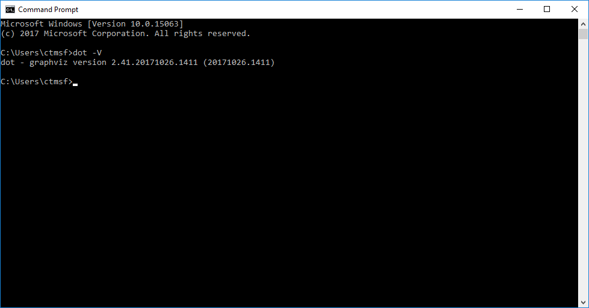
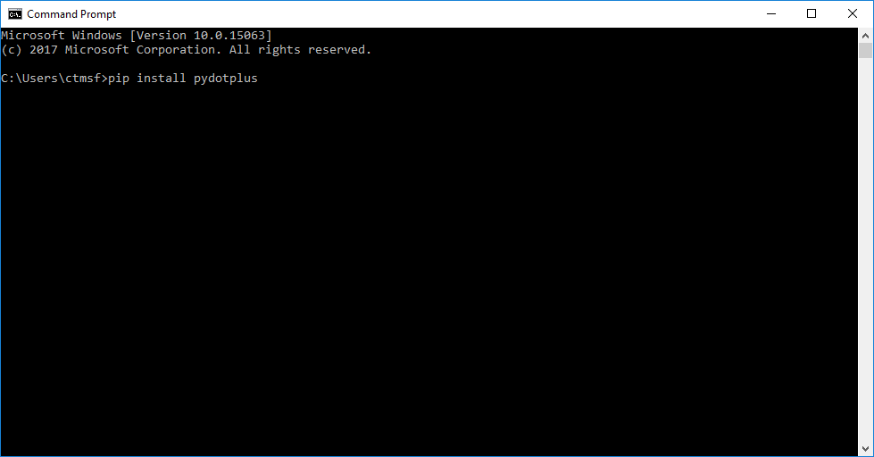
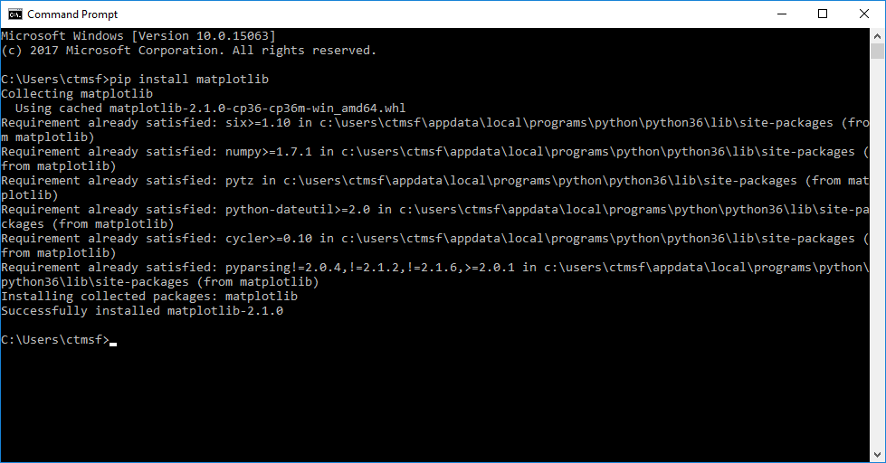
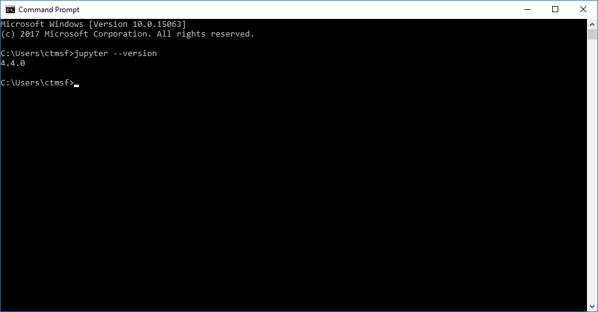

# Install and Connect

DataJoint is implemented for Python 3.4+.
You may install it from [PyPI](https://pypi.python.org/pypi/datajoint):

```bash
pip3 install datajoint
```

or upgrade

```bash
pip3 install --upgrade datajoint
```

## DataJoint Python Windows Install Guide

This document outlines the steps necessary to install DataJoint on Windows for use in 
connecting to a remote server hosting a DataJoint database.
Some limited discussion of installing MySQL is discussed in `MySQL for Windows`, but is 
not covered in-depth since this is an uncommon usage scenario and not strictly required 
to connect to DataJoint pipelines.

### Quick steps

Quick install steps for advanced users are as follows:

- Install latest Python 3.x and ensure it is in `PATH` (3.6.3 current at time of writing)
  ```bash
  pip install datajoint
  ```

For ERD drawing support:

- Install Graphviz for Windows and ensure it is in `PATH` (64 bit builds currently 
tested; URL below.)
  ```bash
  pip install pydotplus matplotlib
  ```

Detailed instructions follow.

### Step 1: install Python

Python for Windows is available from:

https://www.python.org/downloads/windows

The latest 64 bit 3.x version, currently 3.6.3, is available from the [Python site](https://www.python.org/ftp/python/3.6.3/python-3.6.3-amd64.exe).

From here run the installer to install Python.

For a single-user machine, the regular installation process is sufficient - be sure to 
select the `Add Python to PATH` option:

{: style="align:left"}

For a shared machine, run the installer as administrator (right-click, run as 
administrator) and select the advanced installation.
Be sure to select options as follows:

{: style="align:left"}
{: style="align:left"}

### Step 2: verify installation

To verify the Python installation and make sure that your system is ready to install 
DataJoint, open a command window by entering `cmd` into the Windows search bar:

{: style="align:left"}

From here `python` and the Python package manager `pip` can be verified by running 
`python -V` and `pip -V`, respectively:

{: style="align:left"}

If you receive the error message that either `pip` or `python` is not a recognized 
command, please uninstall Python and ensure that the option to add Python to the `PATH` 
variable was properly configured.

### Step 3: install DataJoint

DataJoint (and other Python modules) can be easily installed using the `pip` Python 
package manager which is installed as a part of Python and was verified in the previous 
step.

To install DataJoint simply run `pip install datajoint`:

{: style="align:left"}

This will proceed to install DataJoint, along with several other required packages from 
the PIP repository.
When finished, a summary of the activity should be presented:

{: style="align:left"}

Note: You can find out more about the packages installed here and many other freely 
available open source packages via [pypi](https://pypi.python.org/pypi), the Python 
package index site.

### (Optional) step 4: install packages for ERD support

To draw diagrams of your DataJoint schema, the following additional steps should be 
followed.

#### Install Graphviz

DataJoint currently utilizes [Graphviz](http://graphviz.org) to generate the ERD 
visualizations.
Although a Windows version of Graphviz is available from the main site, it is an older 
and out of date 32-bit version.
The recommended pre-release builds of the 64 bit version are available here:

https://ci.appveyor.com/project/ellson/graphviz-pl238

More specifically, the build artifacts from the `Win64; Configuration: Release` are 
recommended, available 
[here](https://ci.appveyor.com/api/buildjobs/hlkclpfhf6gnakjq/artifacts/build%2FGraphviz-install.exe).

This is a regular Windows installer executable, and will present a dialog when starting:

{: style="align:left"}

It is important that an option to place Graphviz in the `PATH` be selected.

For a personal installation:

{: style="align:left"}

To install system wide:

{: style="align:left"}

Once installed, Graphviz can be verified from a fresh command window as follows:

{: style="align:left"}

If you receive the error message that the `dot` program is not a recognized command, 
please uninstall Graphviz and ensure that the
option to add Python to the PATH variable was properly configured.

Important: in some cases, running the `dot -c` command in a command prompt is required 
to properly initialize the Graphviz installation.

#### Install PyDotPlus

The PyDotPlus library links the Graphviz installation to DataJoint and is easily 
installed via `pip`:

{: style="align:left"}

#### Install Matplotlib

The Matplotlib library provides useful plotting utilities which are also used by 
DataJoint's `Diagram` drawing facility.
The package is easily installed via `pip`:

{: style="align:left"}

### (Optional) step 5: install Jupyter Notebook

As described on the www.jupyter.org website:

'''
The Jupyter Notebook is an open-source web application that allows
you to create and share documents that contain live code, equations,
visualizations and narrative text.
'''

Although not a part of DataJoint, Jupyter Notebook can be a very useful tool for 
building and interacting with DataJoint pipelines.
It is easily installed from `pip` as well:

{: style="align:left"}
{: style="align:left"}

Once installed, Jupyter Notebook can be started via the `jupyter notebook` command, 
which should now be on your path:

{: style="align:left"}

By default Jupyter Notebook will start a local private web server session from the 
directory where it was started and start a web browser session connected to the session.

{: style="align:left"}
{: style="align:left"}

You now should be able to use the notebook viewer to navigate the filesystem and to 
create new project folders and interactive Jupyter/Python/DataJoint notebooks.

### Git for Windows

The [Git](https://git-scm.com/) version control system is not a part of DataJoint but 
is recommended for interacting with the broader Python/Git/GitHub sharing ecosystem.

The Git for Windows installer is available from https://git-scm.com/download/win.

{: style="align:left"}

The default settings should be sufficient and correct in most cases.

### MySQL for Windows

For hosting pipelines locally, the MySQL server package is required.

MySQL for windows can be installed via the installers available from the 
[MySQL website](https://dev.mysql.com/downloads/windows/).
Please note that although DataJoint should be fully compatible with a Windows MySQL 
server installation, this mode of operation is not tested by the DataJoint team.
