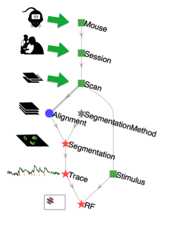

# Data Pipelines

## What is a data pipeline?

A scientific **data pipeline** is a collection of processes and systems for organizing 
the data, computations, and workflows used by a research group as they jointly perform 
complex sequences of data acquisition, processing, and analysis.

A variety of tools can be used for supporting shared data pipelines:

Data repositories
  Research teams set up a shared **data repository**.
  This minimal data management tool allows depositing and retrieving data and managing 
  user access.
  For example, this may include a collection of files with standard naming conventions 
  organized into folders and sub-folders.
  Or a data repository might reside on the cloud, for example in a collection of S3 
  buckets.
  This image of data management -- where files are warehoused and retrieved from a 
  hierarchically-organized system of folders -- is an approach that is likely familiar 
  to most scientists.

Database systems
  **Databases** are a form of data repository providing additional capabilities:

    1. Defining, communicating, and enforcing structure in the stored data.
    2. Maintaining data integrity: correct identification of data and consistent cross-references, dependencies, and groupings among the data.
    3. Supporting queries that retrieve various cross-sections and transformation of the deposited data.

    Most scientists have some familiarity with these concepts, for example the notion of maintaining consistency between data and the metadata that describes it, or applying a filter to an Excel spreadsheet to retrieve specific subsets of information.
    However, usually the more advanced concepts involved in building and using relational databases fall under the specific expertise of data scientists.

Data pipelines
  **Data pipeline** frameworks may include all the features of a database system along 
  with additional functionality:

    1. Integrating computations to perform analyses and manage intermediate results in a principled way.
    2. Supporting distributed computations without conflict.
    3. Defining, communicating, and enforcing **workflow**, making clear the sequence of steps that must be performed for data entry, acquisition, and processing.

    Again, the informal notion of an analysis "workflow" will be familiar to most scientists, along with the logistical difficulties associated with managing a workflow that is shared by multiple scientists within or across labs.

  Therefore, a full-featured data pipeline framework may also be described as a [scientific workflow system](https://en.wikipedia.org/wiki/Scientific_workflow_system).

Major features of data management frameworks: data repositories, databases, and data pipelines.

{: style="align:center"}

## What is DataJoint?

DataJoint is a free open-source framework for creating scientific data pipelines 
directly from MATLAB or Python (or any mixture of the two).
The data are stored in a language-independent way that allows interoperability between 
MATLAB and Python, with additional languages in the works.
DataJoint pipelines become the central tool in the operations of data-intensive labs or 
consortia as they organize participants with different roles and skills around a common 
framework.

In DataJoint, a data pipeline is a sequence of steps (more generally, a directed 
acyclic graph) with integrated data storage at each step.
The pipeline may have some nodes requiring manual data entry or import from external 
sources, some that read from raw data files, and some that perform computations on data 
stored in other database nodes.
In a typical scenario, experimenters and acquisition instruments feed data into nodes 
at the head of the pipeline, while downstream nodes perform automated computations for 
data processing and analysis.

For example, this is the pipeline for a simple mouse experiment involving calcium 
imaging in mice.

{: style="width:250px; align:center"}

In this example, the experimenter first enters information about a mouse, then enters 
information about each imaging session in that mouse, and then each scan performed in 
each imaging session.
Next the automated portion of the pipeline takes over to import the raw imaging data, 
perform image alignment to compensate for motion, image segmentation to identify cells 
in the images, and extraction of calcium traces.
Finally, the receptive field (RF) computation is performed by relating the calcium 
signals to the visual stimulus information.

## How DataJoint works

DataJoint enables data scientists to build and operate scientific data pipelines.

Conceptual overview of DataJoint operation.

{: style="align:center"}

DataJoint provides a simple and powerful data model, which is detailed more formally in [Yatsenko D, Walker EY, Tolias AS (2018). DataJoint: A Simpler Relational Data Model.](https://arxiv.org/abs/1807.11104).
Put most generally, a "data model" defines how to think about data and the operations 
that can be performed on them.
DataJoint's model is a refinement of the relational data model: all nodes in the 
pipeline are simple tables storing data, tables are related by their shared attributes, 
and query operations can combine the contents of multiple tables.
DataJoint enforces specific constraints on the relationships between tables that help 
maintain data integrity and enable flexible access.
DataJoint uses a succinct data definition language, a powerful data query language, and 
expressive visualizations of the pipeline.
A well-defined and principled approach to data organization and computation enables 
teams of scientists to work together efficiently.
The data become immediately available to all participants with appropriate access privileges.
Some of the "participants" may be computational agents that perform processing and 
analysis, and so DataJoint features a built-in distributed job management process to 
allow distributing analysis between any number of computers.

From a practical point of view, the back-end data architecture may vary depending on 
project requirements.
Typically, the data architecture includes a relational database server (e.g. MySQL) and 
a bulk data storage system (e.g. [AWS S3](https://aws.amazon.com/s3/) or a filesystem).
However, users need not interact with the database directly, but via MATLAB or Python 
objects that are each associated with an individual table in the database.
One of the main advantages of this approach is that DataJoint clearly separates the 
data model facing the user from the data architecture implementing data management and 
computing. DataJoint works well in combination with good code sharing (e.g. with 
[git](https://git-scm.com/)) and environment sharing (e.g. with 
[Docker](https://www.docker.com/)).

DataJoint is designed for quick prototyping and continuous exploration as experimental 
designs change or evolve.
New analysis methods can be added or removed at any time, and the structure of the 
workflow itself can change over time, for example as new data acquisition methods are 
developed.

With DataJoint, data sharing and publishing is no longer a separate step at the end of 
the project.
Instead data sharing is an inherent feature of the process: to share data with other 
collaborators or to publish the data to the world, one only needs to set the access 
privileges.

## Real-life example

The [Mesoscale Activity Project](https://www.simonsfoundation.org/funded-project/%20multi-regional-neuronal-dynamics-of-memory-guided-flexible-behavior/) 
(MAP) is a collaborative project between four neuroscience labs.
MAP uses DataJoint for data acquisition, processing, analysis, interfaces, and external sharing.

The DataJoint pipeline for the MAP project.

{: style="align:center"}

The pipeline is hosted in the cloud through [Amazon Web Services](https://aws.amazon.com/) (AWS).
MAP data scientists at the Janelia Research Campus and Baylor College of Medicine 
defined the data pipeline.
Experimental scientists enter manual data directly into the pipeline using the 
[Helium web interface](https://github.com/mattbdean/Helium).
The raw data are preprocessed using the DataJoint client libraries in MATLAB and Python;
the preprocessed data are ingested into the pipeline while the bulky and raw data are 
shared using [Globus](https://globus.org) transfer through the 
[PETREL](https://www.alcf.anl.gov/petrel) storage servers provided by the Argonne 
National Lab.
Data are made immediately available for exploration and analysis to collaborating labs, 
and the analysis results are also immediately shared.
Analysis data may be visualized through web interfaces.
Intermediate results may be exported into the [NWB](https://nwb.org) format for sharing 
with external groups.

## Summary of DataJoint features

1. A free, open-source framework for scientific data pipelines and workflow management
1. Data hosting in cloud or in-house
1. MySQL, filesystems, S3, and Globus for data management
1. Define, visualize, and query data pipelines from MATLAB or Python
1. Enter and view data through GUIs
1. Concurrent access by multiple users and computational agents
1. Data integrity: identification, dependencies, groupings
1. Automated distributed computation
