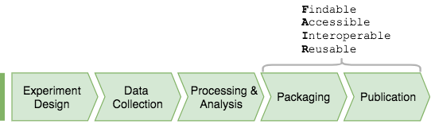
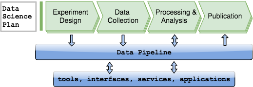
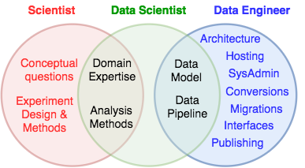

# Teamwork

## Data management in a science project

Science labs organize their projects as a sequence of activities of experiment design, 
data acquisition, and processing and analysis.

<figure markdown>
     {: style="width:520px; align:center"}
     <figcaption>Workflow and dataflow in a common findings-centered approach to data science in a science lab.</figcaption>
</figure>

Many labs lack a uniform data management strategy that would span longitudinally across 
the entire project lifecycle as well as laterally across different projects.

Prior to publishing their findings, the research team may need to publish the data to 
support their findings.
Without a data management system, this requires custom repackaging of the data to 
conform to the [FAIR principles](https://www.nature.com/articles/sdata201618) for 
scientific data management.

## Data-centric project organization

DataJoint is designed to support a data-centric approach to large science projects in 
which data are viewed as a principal output of the research project and are managed 
systematically throughout in a single framework through the entire process.

This approach requires formulating a general data science plan and upfront investment 
for setting up resources and processes and training the teams.
The team uses DataJoint to build data pipelines to support multiple projects.

<figure markdown>
     {: style="width:510px; align:center"}
     <figcaption>Workflow and dataflow in a data pipeline-centered approach.</figcaption>
</figure>

Data pipelines support project data across their entire lifecycle, including the 
following functions

- experiment design
- animal colony management
- electronic lab book: manual data entry during experiments through graphical user interfaces.
- acquisition from instrumentation in the course of experiments
- ingest from raw acquired data
- computations for data analysis
- visualization of analysis results
- export for sharing and publishing

Through all these activities, all these data are made accessible to all authorized 
participants and distributed computations can be done in parallel without compromising 
data integrity.

## Team roles

The adoption of a uniform data management framework allows separation of roles and 
division of labor among team members, leading to greater efficiency and better scaling.

<figure markdown>
     {: style="width:350px; align:center"}
     <figcaption>Distinct responsibilities of data science and data engineering.</figcaption>
</figure>

Scientists

    design and conduct experiments, collecting data.
    They interact with the data pipeline through graphical user interfaces designed by 
    others.
    They understand what analysis is used to test their hypotheses.

Data scientists

    have the domain expertise and select and implement the processing and analysis 
    methods for experimental data.
    Data scientists are in charge of defining and managing the data pipeline using 
    DataJoint's data model, but they may not know the details of the underlying 
    architecture.
    They interact with the pipeline using client programming interfaces directly from 
    languages such as MATLAB and Python.

    The bulk of this manual is written for working data scientists, except for System 
    Administration.

Data engineers

    work with the data scientists to support the data pipeline.
    They rely on their understanding of the DataJoint data model to configure and 
    administer the required IT resources such as database servers, data storage 
    servers, networks, cloud instances, [Globus](https://globus.org) endpoints, etc.
    Data engineers can provide general solutions such as web hosting, data publishing, 
    interfaces, exports and imports.

    The System Administration section of this tutorial contains materials helpful in 
    accomplishing these tasks.

DataJoint is designed to delineate a clean boundary between **data science** and **data 
engineering**.
This allows data scientists to use the same uniform data model for data pipelines 
backed by a variety of information technologies.
This delineation also enables economies of scale as a single data engineering team can 
support a wide spectrum of science projects.
