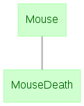

# Data Integrity

The term **data integrity** describes  guarantees made by the data management process 
that prevent errors and corruption in data due to technical failures and human errors 
arising in the course of continuous use by multiple agents.
DataJoint pipelines respect the following forms of data integrity: **entity 
integrity**, **referential integrity**, and **group integrity** as described in more 
detail below.

## Entity integrity

In a proper relational design, each table represents a collection of discrete 
real-world entities of some kind.
**Entity integrity** is the guarantee made by the data management process that entities 
from the real world are reliably and uniquely represented in the database system.
Entity integrity states that the data management process must prevent duplicate 
representations or misidentification of entities.
DataJoint enforces entity integrity through the use of 
[primary keys](./tables/primary.md).

Entity integrity breaks down when a process allows data pertaining to the same 
real-world entity to be entered into the database system multiple times.
For example, a school database system may use unique ID numbers to distinguish students.
Suppose the system automatically generates an ID number each time a student record is 
entered into the database without checking whether a record already exists for that 
student.
Such a system violates entity integrity, because the same student may be assigned 
multiple ID numbers.
The ID numbers succeed in uniquely identifying each student record but fail to do so 
for the actual students.

Note that a database cannot guarantee or enforce entity integrity by itself.
Entity integrity is a property of the entire data management process as a whole, 
including institutional practices and user actions in addition to database 
configurations.

## Referential integrity

**Referential integrity** is the guarantee made by the data management process that 
related data across the database remain present, correctly associated, and mutually 
consistent.
Guaranteeing referential integrity means enforcing the constraint that no entity can 
exist in the database without all the other entities on which it depends.
Referential integrity cannot exist without entity integrity: references to entity 
cannot be validated if the identity of the entity itself is not guaranteed.

Referential integrity fails when a data management process allows new data to be 
entered that refers to other data missing from the database.
For example, assume that each electrophysiology recording must refer to the mouse 
subject used during data collection.
Perhaps an experimenter attempts to insert ephys data into the database that refers to 
a nonexistent mouse, due to a misspelling.
A system guaranteeing referential integrity, such as DataJoint, will refuse the 
erroneous data.

Enforcement of referential integrity does not stop with data ingest.
[Deleting](../manipulation/delete.md) data in DataJoint also deletes any dependent 
downstream data.
Such cascading deletions are necessary to maintain referential integrity.
Consider the deletion of a mouse subject without the deletion of the experimental 
sessions involving that mouse.
A database that allows such deletion will break referential integrity, as the 
experimental sessions for the removed mouse depend on missing data.
Any data management process that allows data to be deleted with no consideration of 
dependent data cannot maintain referential integrity.

[Updating](../manipulation/update.md) data already present in a database system also 
jeopardizes referential integrity.
For this reason, the DataJoint workflow does not include updates to entities once they 
have been ingested into a pipeline.
Allowing updates to upstream entities would break the referential integrity of any 
dependent data downstream.
For example, permitting a user to change the name of a mouse subject would invalidate 
any experimental sessions that used that mouse, presuming the mouse name was part of 
the primary key.
The proper way to change data in DataJoint is to delete the existing entities and to 
insert corrected ones, preserving referential integrity.

## Group integrity

**Group integrity** denotes the guarantee made by the data management process that 
entities composed of multiple parts always appear in their complete form.
Group integrity in DataJoint is formalized through 
[master-part](./tables/master-part.md) relationships.
The master-part relationship has important implications for dependencies, because a 
downstream entity depending on a master entity set may be considered to depend on the 
parts as well.

## Relationships

In DataJoint, the term **relationship** is used rather generally to describe the 
effects of particular configurations of [dependencies](./tables/dependencies.md) 
between multiple entity sets.
It is often useful to classify relationships as one-to-one, many-to-one, one-to-many, 
and many-to-many.

In a **one-to-one relationship**, each entity in a downstream table has exactly one 
corresponding entity in the upstream table.
A dependency of an entity set containing the death dates of mice on an entity set 
describing the mice themselves would obviously be a one-to-one relationship, as in the 
example below.

```python
@schema
class Mouse(dj.Manual):
definition = """
mouse_name : varchar(64)
---
mouse_dob : datetime
"""

@schema
class MouseDeath(dj.Manual):
definition = """
-> Mouse
---
death_date : datetime
"""
```

{: style="align:center"}

In a **one-to-many relationship**, multiple entities in a downstream table may depend 
on the same entity in the upstream table.
The example below shows a table containing individual channel data from multi-channel 
recordings, representing a one-to-many relationship.

```python
@schema
class EEGRecording(dj.Manual):
definition = """
-> Session
eeg_recording_id : int
---
eeg_system : varchar(64)
num_channels : int
"""

@schema
class ChannelData(dj.Imported):
definition = """
-> EEGRecording
channel_idx : int
---
channel_data : longblob
"""
```
{: style="align:center"}

In a **many-to-one relationship**, each entity in a table is associated with multiple 
entities from another table.
Many-to-one relationships between two tables are usually established using a separate 
membership table.
The example below includes a table of mouse subjects, a table of subject groups, and a 
membership [part table](./tables/master-part.md) listing the subjects in each group.
A many-to-one relationship exists between the `Mouse` table and the `SubjectGroup` 
table, with is expressed through entities in `GroupMember`.

```python
@schema
class Mouse(dj.Manual):
definition = """
mouse_name : varchar(64)
---
mouse_dob : datetime
"""

@schema
class SubjectGroup(dj.Manual):
definition = """
group_number : int
---
group_name : varchar(64)
"""

class GroupMember(dj.Part):
     definition = """
     -> master
     -> Mouse
     """
```

{: style="align:center"}

In a **many-to-many relationship**, multiple entities in one table may each relate to 
multiple entities in another upstream table.
Many-to-many relationships between two tables are usually established using a separate 
association table.
Each entity in the association table links one entity from each of the two upstream 
tables it depends on.
The below example of a many-to-many relationship contains a table of recording 
modalities and a table of multimodal recording sessions.
Entities in a third table represent the modes used for each session.

```python
@schema
class RecordingModality(dj.Lookup):
definition = """
modality : varchar(64)
"""

@schema
class MultimodalSession(dj.Manual):
definition = """
-> Session
modes : int
"""
class SessionMode(dj.Part):
     definition = """
     -> master
     -> RecordingModality
     """
```

{: style="align:center"}

The types of relationships between entity sets are expressed in the 
[Diagram](diagrams.md) of a schema.
