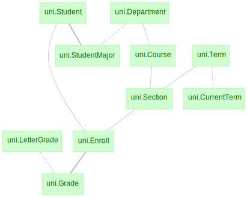
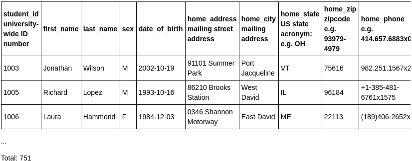
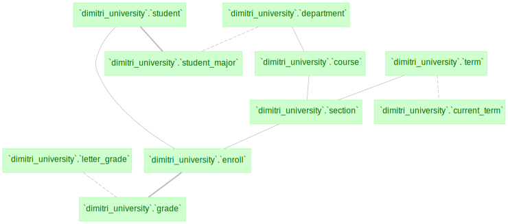
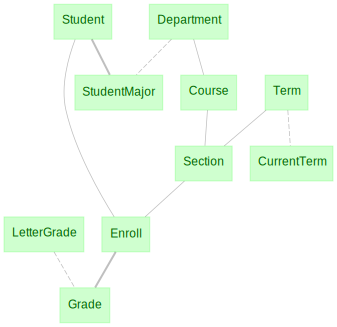
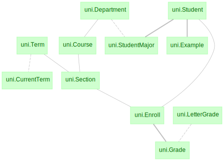

# Work with Existing Pipelines

## Loading Classes

This section describes how to work with database schemas without access to the
original code that generated the schema. These situations often arise when the
database is created by another user who has not shared the generating code yet
or when the database schema is created from a programming language other than
Python.

```python
import datajoint as dj
```

### Working with schemas and their modules

Typically a DataJoint schema is created as a dedicated Python module. This
module defines a schema object that is used to link classes declared in the
module to tables in the database schema. As an example, examine the university
module: [university.py](https://github.com/datajoint-company/db-programming-with-datajoint/blob/master/notebooks/university.py).

You may then import the module to interact with its tables:

```python
import university as uni
dj.Diagram(uni)
```

{: style="align:center"}

Note that dj.Diagram can extract the diagram from a schema object or from a
Python module containing its schema object, lending further support to the
convention of one-to-one correspondence between database schemas and Python
modules in a DataJoint project:

`dj.Diagram(uni)`

is equivalent to

`dj.Diagram(uni.schema)`

```python
# students without majors
uni.Student - uni.StudentMajor
```

{: style="align:center"}

### Spawning missing classes

Now imagine that you do not have access to `university.py` or you do not have
its latest version. You can still connect to the database schema but you will
not have classes declared to interact with it.

So let's start over in this scenario.

You may use the `dj.list_schemas` function (new in DataJoint 0.12.0) to
list the names of database schemas available to you.

```python
import datajoint as dj
dj.list_schemas()
```

```text
*['dimitri_alter','dimitri_attach','dimitri_blob','dimitri_blobs',
'dimitri_nphoton','dimitri_schema','dimitri_university','dimitri_uuid',
'university']*
```

Just as with a new schema, we start by creating a schema object to connect to
the chosen database schema:

```python
schema = dj.Schema('dimitri_university')
```

If the schema already exists, `dj.Schema` is initialized as usual and you may plot
the schema diagram. But instead of seeing class names, you will see the raw
table names as they appear in the database.

```python
# let's plot its diagram
dj.Diagram(schema)
```

{: style="align:center"}

You may view the diagram but, at this point, there is no way to interact with
these tables. A similar situation arises when another developer has added new
tables to the schema but has not yet shared the updated module code with you.
Then the diagram will show a mixture of class names and database table names.

Now you may use the `spawn_missing_classes` method to spawn classes into
the local namespace for any tables missing their classes:

```python
schema.spawn_missing_classes()
dj.Diagram(schema)
```

{: style="align:center"}

Now you may interact with these tables as if they were declared right here in
this namespace:

```python
# students without majors
Student - StudentMajor
```

{: style="align:center"}

### Creating a virtual module

Virtual modules provide a way to access the classes corresponding to tables in a 
DataJoint schema without having to create local files.

`spawn_missing_classes` creates the new classes in the local namespace.
However, it is often more convenient to import a schema with its Python module,
equivalent to the Python command:

```python
import university as uni
```

We can mimic this import without having access to `university.py` using the 
`VirtualModule` class object:

```python
import datajoint as dj

uni = dj.VirtualModule(module_name='university.py', schema_name='dimitri_university')
```

Now `uni` behaves as an imported module complete with the schema object and all
the table classes.

```python
dj.Diagram(uni)
```

{: style="align:center"}

```python
uni.Student - uni.StudentMajor
```

{: style="align:center"}

`dj.VirtualModule` takes required arguments

- `module_name`: displayed module name.

- `schema_name`: name of the database in MySQL.

And `dj.VirtualModule` takes optional arguments.

First, `create_schema=False` assures that an error is raised when the schema
does not already exist. Set it to `True` if you want to create an empty schema.

```python
dj.VirtualModule('what', 'nonexistent')
```

Returns

```python
---------------------------------------------------------------------------
DataJointError                            Traceback (most recent call last)
.
.
.
DataJointError: Database named `nonexistent` was not defined. Set argument create_schema=True to create it.
```

The other optional argument, `create_tables=False` is passed to the schema
object. It prevents the use of the schema object of the virtual module for
creating new tables in the existing schema. This is a precautionary measure
since virtual modules are often used for completed schemas. You may set this
argument to `True` if you wish to add new tables to the existing schema. A
more common approach in this scenario would be to create a new schema object and
to use the `spawn_missing_classes` function to make the classes available.

However, you if do decide to create new tables in an existing tables using the
virtual module, you may do so by using the schema object from the module as the
decorator for declaring new tables:

```python
uni = dj.VirtualModule('university.py', 'dimitri_university', create_tables=True)
```

```python
@uni.schema
class Example(dj.Manual):
    definition = """
    -> uni.Student
    ---
    example : varchar(255)
    """
```

```python
dj.Diagram(uni)
```

{: style="align:center"}
