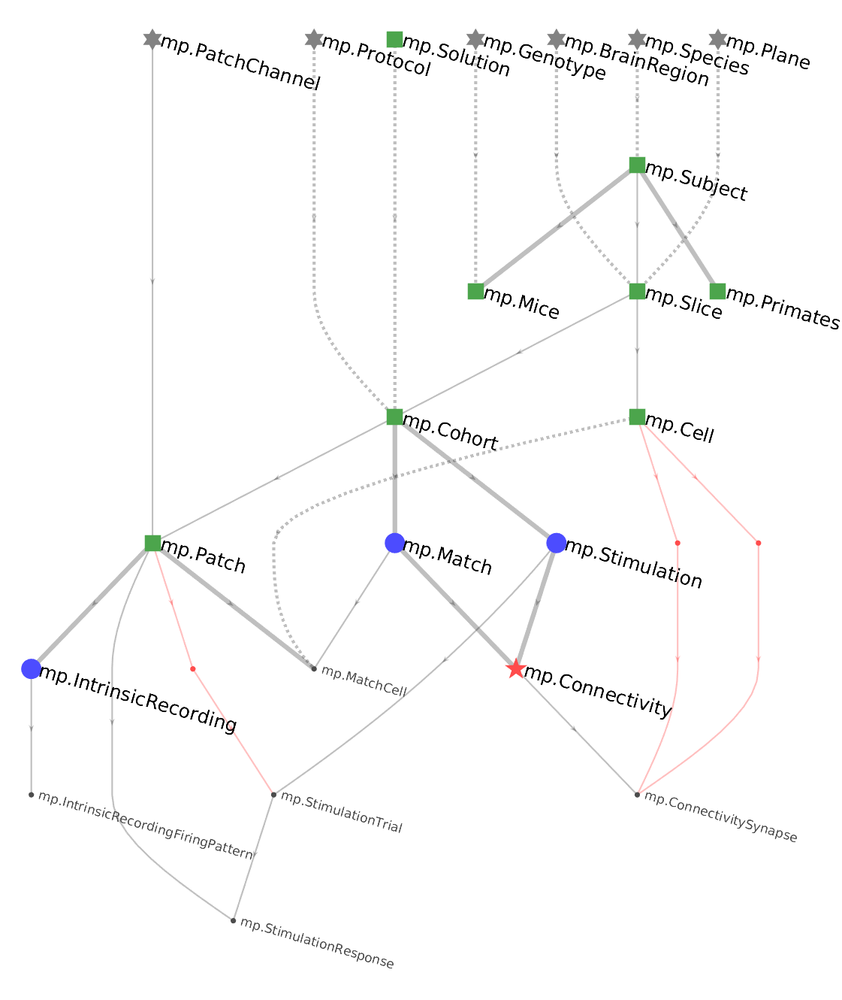

# Dependencies

## Understanding dependencies

A schema contains collections of tables of related data.
Accordingly, entities in one table often derive some of their meaning or context from 
entities in other tables.
A **foreign key** defines a **dependency** of entities in one table on entities in 
another within a schema.
In more complex designs, dependencies can even exist between entities in tables from 
different schemas.
Dependencies play a functional role in DataJoint and do not simply label the structure 
of a pipeline.
Dependencies provide entities in one table with access to data in another table and 
establish certain constraints on entities containing a foreign key.

A DataJoint pipeline, including the dependency relationships established by foreign 
keys, can be visualized as a graph with nodes and edges.
The diagram of such a graph is called the **entity relationship diagram** or 
[Diagram](../diagrams.md).
The nodes of the graph are tables and the edges connecting them are foreign keys.
The edges are directed and the overall graph is a **directed acyclic graph**, a graph 
with no loops.

For example, the Diagram below is the pipeline for multipatching experiments

{: style="align:center"}

The graph defines the direction of the workflow.
The tables at the top of the flow need to be populated first, followed by those tables 
one step below and so forth until the last table is populated at the bottom of the 
pipeline.
The top of the pipeline tends to be dominated by lookup tables (gray stars) and manual 
tables (green squares).
The middle has many imported tables (blue triangles), and the bottom has computed 
tables (red stars).

## Defining a dependency

Foreign keys are defined with arrows `->` in the [table definition](declare.md), 
pointing to another table.

A foreign key may be defined as part of the [primary-key](primary.md).

In the Diagram, foreign keys from the primary key are shown as solid lines.
This means that the primary key of the referenced table becomes part of the primary key 
of the new table.
A foreign key outside the primary key is indicated by dashed line in the ERD.

For example, the following definition for the table `mp.Slice` has three foreign keys, 
including one within the primary key.

```python
# brain slice
-> mp.Subject
slice_id        : smallint       # slice number within subject
---
-> mp.BrainRegion
-> mp.Plane
slice_date        : date                 # date of the slicing (not patching)
thickness         : smallint unsigned    # slice thickness in microns
experimenter      : varchar(20)          # person who performed this experiment
```

You can examine the resulting table heading with

```python
mp.BrainSlice.heading
```

The heading of `mp.Slice` may look something like

```python
subject_id      : char(8)        # experiment subject id
slice_id        : smallint       # slice number within subject
---
brain_region        : varchar(12)        # abbreviated name for brain region
plane               : varchar(12)        # plane of section
slice_date          : date               # date of the slicing (not patching)
thickness           : smallint unsigned  # slice thickness in microns
experimenter        : varchar(20)        # person who performed this experiment
```

This displayed heading reflects the actual attributes in the table.
The foreign keys have been replaced by the primary key attributes of the referenced 
tables, including their data types and comments.

## How dependencies work

The foreign key `-> A` in the definition of table `B` has the following effects:

1. The primary key attributes of `A` are made part of `B`'s definition.
2. A referential constraint is created in `B` with reference to `A`.
3. If one does not already exist, an index is created to speed up searches in `B` for 
matches to `A`.
   (The reverse search is already fast because it uses the primary key of `A`.)

A referential constraint means that an entity in `B` cannot exist without a matching 
entity in `A`.
**Matching** means attributes in `B` that correspond to the primary key of `A` must 
have the same values.
An attempt to insert an entity into `B` that does not have a matching counterpart in 
`A` will fail.
Conversely, deleting an entity from `A` that has matching entities in `B` will result 
in the deletion of those matching entities and so forth, recursively, downstream in the 
pipeline.

When `B` references `A` with a foreign key, one can say that `B` **depends** on `A`.
In DataJoint terms, `B` is the **dependent table** and `A` is the **referenced table** 
with respect to the foreign key from `B` to `A`.

Note to those already familiar with the theory of relational databases: The usage of 
the words "depends" and "dependency" here should not be confused with the unrelated 
concept of *functional dependencies* that is used to define normal forms.

## Referential integrity

Dependencies enforce the desired property of databases known as 
**referential integrity**.
Referential integrity is the guarantee made by the data management process that related 
data across the database remain present, correctly associated, and mutually consistent.
Guaranteeing referential integrity means enforcing the constraint that no entity can 
exist in the database without all the other entities on which it depends.
An entity in table `B` depends on an entity in table `A` when they belong to them or 
are computed from them.

## Dependencies with renamed attributes

In most cases, a dependency includes the primary key attributes of the referenced table 
as they appear in its table definition.
Sometimes it can be helpful to choose a new name for a foreign key attribute that 
better fits the context of the dependent table.
DataJoint provides the following [projection](../../query/project.md) syntax to rename 
the primary key attributes when they are included in the new table.

The dependency

```python
->  Table.project(new_attr='old_attr')
```

renames the primary key attribute `old_attr` of `Table` as `new_attr` before 
integrating it into the table definition.
Any additional primary key attributes will retain their original names.
For example, the table `Experiment` may depend on table `User` but rename the `user` 
attribute into `operator` as follows:

```python
-> User.proj(operator='user')
```

In the above example, an entity in the dependent table depends on exactly one entity in 
the referenced table.
Sometimes entities may depend on multiple entities from the same table.
Such a design requires a way to distinguish between dependent attributes having the 
same name in the reference table.
For example, a table for `Synapse` may reference the table `Cell` twice as 
`presynaptic` and `postsynaptic`.
The table definition may appear as

```python
# synapse between two cells
-> Cell.proj(presynaptic='cell_id')
-> Cell.proj(postsynaptic='cell_id')
---
connection_strength : double  # (pA) peak synaptic current
```

If the primary key of `Cell` is (`animal_id`, `slice_id`, `cell_id`), then the primary 
key of `Synapse` resulting from the above definition will be (`animal_id`, `slice_id`, 
`presynaptic`, `postsynaptic`).
Projection always returns all of the primary key attributes of a table, so `animal_id` 
and `slice_id` are included, with their original names.

Note that the design of the `Synapse` table above imposes the constraint that the 
synapse can only be found between cells in the same animal and in the same slice.

Allowing representation of synapses between cells from different slices requires the 
renamimg of `slice_id` as well:

```python
# synapse between two cells
-> Cell(presynaptic_slice='slice_id', presynaptic_cell='cell_id')
-> Cell(postsynaptic_slice='slice_id', postsynaptic_cell='cell_id')
---
connection_strength : double  # (pA) peak synaptic current
```

In this case, the primary key of `Synapse` will be (`animal_id`, `presynaptic_slice`, 
`presynaptic_cell`, `postsynaptic_slice`, `postsynaptic_cell`).
This primary key still imposes the constraint that synapses can only form between cells 
within the same animal but now allows connecting cells across different slices.

In the Diagram, renamed foreign keys are shown as red lines with an additional dot node 
in the middle to indicate that a renaming took place.

## Foreign key options

Note: Foreign key options are currently in development.

Foreign keys allow the additional options `nullable` and `unique`, which can be 
inserted in square brackets following the arrow.

For example, in the following table definition

```python
rig_id  : char(4)   # experimental rig
---
-> Person
```

each rig belongs to a person, but the table definition does not prevent one person 
owning multiple rigs.
With the `unique` option, a person may only appear once in the entire table, which 
means that no one person can own more than one rig.

```python
rig_id  : char(4)   # experimental rig
---
-> [unique] Person
```

With the `nullable` option, a rig may not belong to anyone, in which case the foreign 
key attributes for `Person` are set to `NULL`:

```python
rig_id  : char(4)   # experimental rig
---
-> [nullable] Person
```

Finally with both `unique` and `nullable`, a rig may or may not be owned by anyone and 
each person may own up to one rig.

```python
rig_id  : char(4)   # experimental rig
---
-> [unique, nullable] Person
```

Foreign keys made from the primary key cannot be nullable but may be unique.
