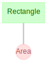

# Getting Started

## Installation

First, please [install Python](https://www.python.org/downloads/) version
3.7 or later. We recommend 3.8.

Next, please install DataJoint via one of the following:

=== "conda"

    !!! note "Pre-Requisites"

        - Ensure you have [conda](https://conda.io/projects/conda/en/latest/user-guide/install/index.html#regular-installation)
        installed.

    To add the `conda-forge` channel:

    ```bash
    conda config --add channels conda-forge
    ```

    To install:

    ```bash
    conda install -c conda-forge datajoint
    ```

=== "pip + :fontawesome-brands-windows:"

    !!! note "Pre-Requisites"

        - Ensure you have [pip](https://pip.pypa.io/en/stable/installation/) installed.
        - Install [graphviz](https://graphviz.org/download/#windows) pre-requisite for
          diagram visualization.

    To install:

    ```bash
    pip install datajoint
    ```

=== "pip + :fontawesome-brands-apple:"

    !!! note "Pre-Requisites"

        - Ensure you have [pip](https://pip.pypa.io/en/stable/installation/) installed.
        - Install [graphviz](https://graphviz.org/download/#mac) pre-requisite for
          diagram visualization.

    To install:

    ```bash
    pip install datajoint
    ```

=== "pip + :fontawesome-brands-linux:"

    !!! note "Pre-Requisites"

        - Ensure you have [pip](https://pip.pypa.io/en/stable/installation/) installed.
        - Install [graphviz](https://graphviz.org/download/#linux) pre-requisite for
          diagram visualization.
    
    To install:

    ```bash
    pip install datajoint
    ```

## Connection

!!! note

    Although you may connect to any MySQL server of your choice, the DataJoint company
    offers an online tutorial environment. Simply sign up for a free
    [DataJoint account](https://accounts.datajoint.io). 
    You will be granted privileges to create schemas
    that are prefixed as `{user}_`.

=== "environment variables"

    Before using `datajoint`, set the following environment variables like so:

    ```bash linenums="1"
    DJ_HOST=tutorial-db.datajoint.io
    DJ_USER={user}
    DJ_PASS={password}
    ```

=== "memory"

    To set connection settings within Python, perform:

    ```python linenums="1"
    import datajoint as dj

    dj.config["database.host"] = "tutorial-db.datajoint.io"
    dj.config["database.user"] = "{user}"
    dj.config["database.password"] = "{password}"
    ```

    These configuration settings can be saved either locally or system-wide using one 
    of the following commands:
    ```python
    dj.config.save_local()
    dj.config.save_global()
    ```

=== "file"

    Before using `datajoint`, create a file named `dj_local_conf.json` in the current
    directory like so:

    ```json linenums="1"
    {
        "database.host": "tutorial-db.datajoint.io",
        "database.user": "{user}",
        "database.password": "{password}"
    }
    ```

    These settings will be loaded whenever a Python instance is launched from this 
    directory. To configure settings globally, save a similar file as 
    `.datajoint_config.json` in your home directory. A local config, if present, will 
    take precedent over global settings.

## Data Pipeline Definition

Let's definite a simple data pipeline.

```python linenums="1"
import datajoint as dj
schema = dj.Schema(f"{dj.config['database.user']}_shapes") # (1)

@schema # (2)
class Rectangle(dj.Manual):
    definition = """ # (3)
    shape_id: int
    ---
    shape_height: float
    shape_width: float
    """


@schema
class Area(dj.Computed):
    definition = """
    -> Rectangle
    ---
    shape_area: float
    """
    def make(self, key):
        rectangle = (Rectangle & key).fetch1()
        Area.insert1(
            dict(
                shape_id=rectangle["shape_id"],
                shape_area=rectangle["shape_height"] * rectangle["shape_width"],
            )
        )
```

1. This statement creates the database schema `{username}_shapes` on the server.

2. The `@schema` decorator for DataJoint classes creates the table on the server.

3. The table is defined by the the `definition` property.

It is a common practice to have a separate Python module for each schema. Therefore,
each such module has only one `dj.Schema` object defined and is usually named
`schema`.

The `dj.Schema` constructor can take a number of optional parameters
after the schema name.

-   `context` - Dictionary for looking up foreign key references.
    Defaults to `None` to use local context.
-   `connection` - Specifies the DataJoint connection object. Defaults
    to `dj.conn()`.
-   `create_schema` - When `False`, the schema object will not create a
    schema on the database and will raise an error if one does not
    already exist. Defaults to `True`.
-   `create_tables` - When `False`, the schema object will not create
    tables on the database and will raise errors when accessing missing
    tables. Defaults to `True`.

The `@schema` decorator uses the class name and the data tier to check whether an
appropriate table exists on the database. If a table does not already exist, the
decorator creates one on the database using the definition property. The decorator
attaches the information about the table to the class, and then returns the class.

## Diagram

### Display

The diagram displays the relationship of the data model in the data pipeline.

This can be done for an entire schema:

```python
dj.Diagram(schema)
```



Or for individual or sets of tables:
```python
dj.Diagram(schema.Rectangle)
dj.Diagram(schema.Rectangle) + dj.Diagram(schema.Area)
```

??? Note "What if I don't see the diagram?"

    Some Python interfaces may require additional `draw` method.

    ```python
    dj.Diagram(schema).draw()
    ```

    Calling the `.draw()` method is not necessary when working in a Jupyter notebook by
    entering `dj.Diagram(schema)` in a notebook cell. The Diagram will automatically
    render in the notebook by calling its `_repr_html_` method. A Diagram displayed
    without `.draw()` will be rendered as an SVG, and hovering the mouse over a table
    will reveal a compact version of the output of the `.describe()` method.

### Customize

Adding or subtracting a number to a diagram object adds nodes downstream or upstream,
respectively, in the pipeline.

``` python
(dj.Diagram(schema.Rectangle)+1).draw() # (1)
```

1. Plot all the tables directly downstream from `schema.Rectangle`

```python
(dj.Diagram('my_schema')-1+1).draw() # (1)
```

1. Plot all tables directly downstream of those directly upstream of this schema.

### Save

The diagram can be saved as either `png` or `svg`.

```python
dj.Diagram(schema).save(filename='my-diagram', format='png')
```

## Add data

Let's add data for a rectangle:

```python
Rectangle.insert1(dict(shape_id=1, shape_height=2, shape_width=4))
```

## Run computation

Let's start the computations on our entity: `Area`.

```python
Area.populate(display_progress=True)
```

## Query

Let's inspect the results.

```python
Area & "shape_area >= 8"
```

| shaped_id | shape_area |
| --- | --- |
| 1 | 8.0 |
