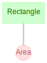

## Installation

=== "conda"

    !!! note "Pre-Requisites"

        - Ensure you have [conda](https://conda.io/projects/conda/en/latest/user-guide/install/index.html#regular-installation) installed.

    To add the `conda-forge` channel:

    ```bash
    conda config --add channels conda-forge
    ```

    To install:

    ```bash
    conda install -c conda-forge datajoint
    ```

=== "pip + :fontawesome-brands-windows:"

    !!! note "Pre-Requisites"

        - Ensure you have [pip](https://pip.pypa.io/en/stable/installation/) installed.
        - Install [graphviz](https://graphviz.org/download/#windows) pre-requisite for
          diagram visualization.

    To install:

    ```bash
    pip install datajoint
    ```

=== "pip + :fontawesome-brands-apple:"

    !!! note "Pre-Requisites"

        - Ensure you have [pip](https://pip.pypa.io/en/stable/installation/) installed.
        - Install [graphviz](https://graphviz.org/download/#mac) pre-requisite for
          diagram visualization.

    To install:

    ```bash
    pip install datajoint
    ```

=== "pip + :fontawesome-brands-linux:"

    !!! note "Pre-Requisites"

        - Ensure you have [pip](https://pip.pypa.io/en/stable/installation/) installed.
        - Install [graphviz](https://graphviz.org/download/#linux) pre-requisite for
          diagram visualization.
    
    To install:

    ```bash
    pip install datajoint
    ```

## Connection

!!! note

    Although you may connect to any MySQL server of your choice, the DataJoint company
    offers an online tutorial environment. Simply sign up for a free[DataJoint account]
    (https://accounts.datajoint.io). You will be granted privileges to create schemas
    that are prefixed as `{user}_`.

=== "environment variables"

    Before using `datajoint`, set the following environment variables like so:

    ```bash linenums="1"
    DJ_HOST=tutorial-db.datajoint.io
    DJ_USER={user}
    DJ_PASS={password}
    ```

=== "memory"

    To set connection settings within Python, perform:

    ```python linenums="1"
    import datajoint as dj

    dj.config["database.host"] = "tutorial-db.datajoint.io"
    dj.config["database.user"] = "{user}"
    dj.config["database.password"] = "{password}"
    ```

=== "file"

    Before using `datajoint`, create a file named `dj_local_conf.json` in the current
    directory like so:

    ```json linenums="1"
    {
        "database.host": "tutorial-db.datajoint.io",
        "database.user": "{user}",
        "database.password": "{password}"
    }
    ```

## Data Pipeline Definition

Let's definite a simple data pipeline.

```python linenums="1"
import datajoint as dj

schema = dj.Schema(f"{dj.config['database.user']}_shapes")


@schema
class Rectangle(dj.Manual):
    definition = """
    shape_id: int
    ---
    shape_height: float
    shape_width: float
    """


@schema
class Area(dj.Computed):
    definition = """
    -> Rectangle
    ---
    shape_area: float
    """
    def make(self, key):
        rectangle = (Rectangle & key).fetch1()
        Area.insert1(
            dict(
                shape_id=rectangle["shape_id"],
                shape_area=rectangle["shape_height"] * rectangle["shape_width"],
            )
        )
```

## Diagram

The diagram displays the relationship of the data model in the data pipeline.

```python
dj.Diagram(schema)
```



## Add data

Let's add data for a rectangle:

```python
Rectangle.insert1(dict(shape_id=1, shape_height=2, shape_width=4))
```

## Run computation

Let's start the computations on our entity: `Area`.

```python
Area.populate(display_progress=True)
```

## Query

Let's inspect the results.

```python
Area & "shape_area >= 8"
```

| shaped_id | shape_area |
| --- | --- |
| 1 | 8.0 |
