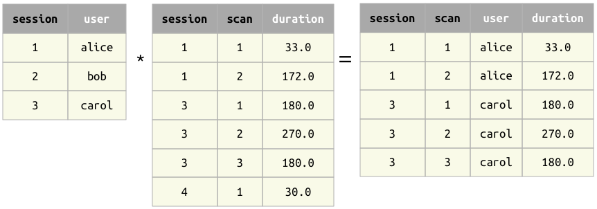

# Join

## Join operator `*`

The Join operator `A * B` combines the matching information in `A` and `B`.
The result contains all matching combinations of entities from both arguments.

### Principles of joins

1. The operands `A` and `B` must be **join-compatible**.
2. The primary key of the result is the union of the primary keys of the operands.

### Examples of joins

Example 1 : When the operands have no common attributes, the result is the cross 
product -- all combinations of entities.

{: style="width:464px; align:center"}

Example 2 : When the operands have common attributes, only entities with matching 
values are kept.

{: style="width:689px; align:center"}

Example 3 : Joining on secondary attribute.

{: style="width:689px; align:center"}

### Properties of join

1. When `A` and `B` have the same attributes, the join `A * B` becomes equivalent to 
the set intersection `A` ∩ `B`.
   Hence, DataJoint does not need a separate intersection operator.

2. Commutativity: `A * B` is equivalent to `B * A`.

3. Associativity: `(A * B) * C` is equivalent to `A * (B * C)`.
