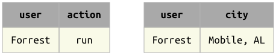
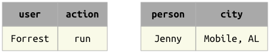
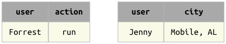

# Operators

[Data queries](principles.md) have the form of expressions using operators to derive 
the desired table.
The expressions themselves do not contain any data.
They represent the desired data symbolically.

Once a query is formed, the [fetch](fetch.md) methods are used to bring the data into 
the local workspace.
Since the expressions are only symbolic representations, repeated `fetch` calls may 
yield different results as the state of the database is modified.

DataJoint implements a complete algebra of operators on tables:

| operator | notation | meaning |
| -- | -- | -- |
| [restriction](restrict.md) | `A & cond` | The subset of entities from table `A` that meet condition `cond` |
| [restriction](restrict.md) | `A - cond` | The subset of entities from table `A` that do not meet condition `cond` |
| [join](join.md) | `A * B` | Combines all matching information from `A` and `B` |
| [proj](project.md) | `A.proj(...)` | Selects and renames attributes from `A` or computes new attributes |
| [aggr](aggregation.md) | `A.aggr(B, ...)` | Same as projection but allows computations based on matching information in `B` |
| [union](union.md) | `A + B` | All unique entities from both `A` and `B` |

## Principles of relational algebra

DataJoint's algebra improves upon the classical relational algebra and upon other query 
languages to simplify and enhance the construction and interpretation of precise and 
efficient data queries.

1. **Entity integrity**: Data are represented and manipulated in the form of tables 
representing [well-formed entity sets](../design/integrity.md).
   This applies to the inputs and outputs of query operators.
   The output of a query operator is an entity set with a well-defined entity type, a 
   primary key, unique attribute names, etc.
2. **Algebraic closure**: All operators operate on entity sets and yield entity sets.
   Thus query expressions may be used as operands in other expressions or may be 
   assigned to variables to be used in other expressions.
3. **Attributes are identified by names**:  All attributes have explicit names.
   This includes results of queries.
   Operators use attribute names to determine how to perform the operation.
   The order of the attributes is not significant.

## Matching entities

Binary operators in DataJoint are based on the concept of **matching entities**; this 
phrase will be used throughout the documentation.

    Two entities **match** when they have no common attributes or when their common 
    attributes contain the same values.

Here **common attributes** are those that have the same names in both entities.
It is usually assumed that the common attributes are of compatible datatypes to allow 
equality comparisons.

Another way to phrase the same definition is

    Two entities match when they have no common attributes whose values differ.

It may be conceptually convenient to imagine that all tables always have an additional 
invisible attribute, `omega` whose domain comprises only one value, 1.
Then the definition of matching entities is simplified:

    Two entities match when their common attributes contain the same values.

Matching entities can be **merged** into a single entity without any conflicts of 
attribute names and values.

### Examples

This is a matching pair of entities:

{: style="width:366px"}

and so is this one:

{: style="width:366px"}

but these entities do *not* match:

{: style="width:366px"}

## Join compatibility

All binary operators with other tables as their two operands require that the operands 
be **join-compatible**, which means that:

1. All common attributes in both operands (attributes with the same name) must be part 
of either the primary key or a foreign key.
2. All common attributes in the two relations must be of a compatible datatype for 
equality comparisons.

These restrictions are introduced both for performance reasons and for conceptual 
reasons.
For performance, they encourage queries that rely on indexes.
For conceptual reasons, they encourage database design in which entities in different 
tables are related to each other by the use of primary keys and foreign keys.
