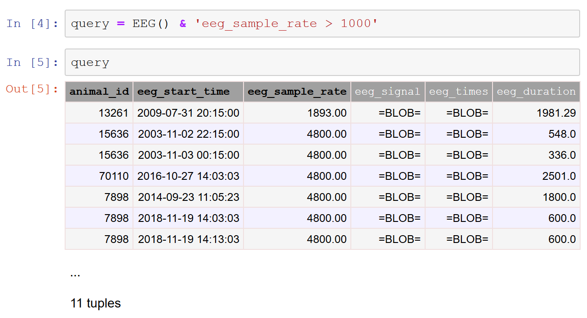

# Query Principles

**Data queries** retrieve data from the database.
A data query is performed with the help of a **query object**, which is a symbolic 
representation of the query that does not in itself contain any actual data.
The simplest query object is an instance of a **table class**, representing the 
contents of an entire table.

For example, if `experiment.Session` is a DataJoint table class, you can create a query 
object to retrieve its entire contents as follows:

```python
query  = experiment.Session()
```

More generally, a query object may be formed as a **query expression** constructed by 
applying [operators](operators.md) to other query objects.

For example, the following query retrieves information about all experiments and scans 
for mouse 102 (excluding experiments with no scans):

```python
query = experiment.Session * experiment.Scan & 'animal_id = 102'
```

Note that for brevity, query operators can be applied directly to class objects rather 
than instance objects so that `experiment.Session` may be used in place of 
`experiment.Session()`.

You can preview the contents of the query in Python, Jupyter Notebook, or MATLAB by 
simply displaying the object.
In the image below, the object `query` is first defined as a restriction of the table 
`EEG` by values of the attribute `eeg_sample_rate` greater than 1000 Hz.
Displaying the object gives a preview of the entities that will be returned by `query`.
Note that this preview only lists a few of the entities that will be returned.
Also, the preview does not contain any data for attributes of datatype `blob`.

{: style="align:center"}

Defining a query object and previewing the entities returned by the query.

Once the desired query object is formed, the query can be executed using its 
[fetch](fetch.md) methods.
To **fetch** means to transfer the data represented by the query object from the 
database server into the workspace of the host language.

```python
s = query.fetch()
```

Here fetching from the `query` object produces the NumPy record array `s` of the 
queried data.

## Checking for returned entities

The preview of the query object shown above displayed only a few of the entities 
returned by the query but also displayed the total number of entities that would be 
returned.
It can be useful to know the number of entities returned by a query, or even whether a 
query will return any entities at all, without having to fetch all the data themselves.

The `bool` function applied to a query object evaluates to `True` if the query returns 
any entities and to `False` if the query result is empty.

The `len` function applied to a query object determines the number of entities returned 
by the query.

```python
# number of sessions since the start of 2018.
n = len(Session & 'session_date >= "2018-01-01"')
```

## Normalization in queries

Query objects adhere to entity [entity normalization](../design/normalization.md) just 
like the stored tables do.
The result of a query is a well-defined entity set with an readily identifiable entity 
class and designated primary attributes that jointly distinguish any two entities from 
each other.
The query [operators](operators.md) are designed to keep the result normalized even in 
complex query expressions.
