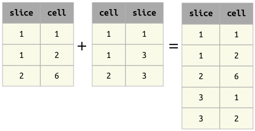

# Union

The union operator is not yet implemented -- this page serves as the specification for 
the upcoming implementation.
Union is rarely needed in practice.

## Union operator `+`

The result of the union operator `A + B` contains all the entities from both operands.
[Entity normalization](../design/normalization.md) requires that the operands in a 
union both belong to the same entity type with the same primary key using homologous 
attributes.
In the absence of any secondary attributes, the result of a union is the simple set union.

When secondary attributes are present, they must have the same names and datatypes in 
both operands.
The two operands must also be **disjoint**, without any duplicate primary key values 
across both inputs.
These requirements prevent ambiguity of attribute values and preserve entity identity.

## Principles of union

1. As in all operators, the order of the attributes in the operands is not significant.
2. Operands `A` and `B` must have the same primary key attributes.
   Otherwise, an error will be raised.
3. Operands `A` and `B` may not have any common non-key attributes.
   Otherwise, an error will be raised.
4. The result `A + B` will have the same primary key as `A` and `B`.
5. The result `A + B` will have all the non-key attributes from both `A` and `B`.
6. For entities that are found in both `A` and `B` (based on the primary key), the 
secondary attributes will be filled from the corresponding entities in `A` and `B`.
7. For entities that are only found in either `A` or `B`, the other operand's secondary 
attributes will filled with null values.

## Examples of union

Example 1 : Note that the order of the attributes does not matter.

{: style="width:404px; align:center"}

Example 2 : Non-key attributes are combined from both tables and filled with NULLs when missing.

{: style="width:539px; align:center"}

## Properties of union

1. Commutative: `A + B` is equivalent to `B + A`.
2. Associative: `(A + B) + C` is equivalent to `A + (B + C)`.
