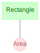

# Quick Start Guide

## Installation

First, please [install Python](https://www.python.org/downloads/) version
3.8 or later.

Next, please install DataJoint via one of the following:

=== "conda"

    Pre-Requisites
    - Ensure you have [conda](https://conda.io/projects/conda/en/latest/user-guide/install/index.html#regular-installation)
    installed.

    To add the `conda-forge` channel:

    ```bash
    conda config --add channels conda-forge
    ```

    To install:

    ```bash
    conda install -c conda-forge datajoint
    ```

=== "pip + :fontawesome-brands-windows:"

    Pre-Requisites
    - Ensure you have [pip](https://pip.pypa.io/en/stable/installation/) installed.
    - Install [graphviz](https://graphviz.org/download/#windows) pre-requisite for
        diagram visualization.

    To install:

    ```bash
    pip install datajoint
    ```

=== "pip + :fontawesome-brands-apple:"

    Pre-Requisites
    - Ensure you have [pip](https://pip.pypa.io/en/stable/installation/) installed.
    - Install [graphviz](https://graphviz.org/download/#mac) pre-requisite for
        diagram visualization.

    To install:

    ```bash
    pip install datajoint
    ```

=== "pip + :fontawesome-brands-linux:"

    Pre-Requisites
    - Ensure you have [pip](https://pip.pypa.io/en/stable/installation/) installed.
    - Install [graphviz](https://graphviz.org/download/#linux) pre-requisite for
        diagram visualization.
    
    To install:

    ```bash
    pip install datajoint
    ```

## Connection

=== "environment variables"

    Before using `datajoint`, set the following environment variables like so:

    ```bash linenums="1"
    DJ_HOST={host_address}
    DJ_USER={user}
    DJ_PASS={password}
    ```

=== "memory"

    To set connection settings within Python, perform:

    ```python linenums="1"
    import datajoint as dj

    dj.config["database.host"] = "{host_address}"
    dj.config["database.user"] = "{user}"
    dj.config["database.password"] = "{password}"
    ```

    These configuration settings can be saved either locally or system-wide using one 
    of the following commands:
    ```python
    dj.config.save_local()
    dj.config.save_global()
    ```

=== "file"

    Before using `datajoint`, create a file named `dj_local_conf.json` in the current
    directory like so:

    ```json linenums="1"
    {
        "database.host": "{host_address}",
        "database.user": "{user}",
        "database.password": "{password}"
    }
    ```

    These settings will be loaded whenever a Python instance is launched from this 
    directory. To configure settings globally, save a similar file as 
    `.datajoint_config.json` in your home directory. A local config, if present, will 
    take precedent over global settings.

## Data Pipeline Definition

Let's definite a simple data pipeline.

```python linenums="1"
import datajoint as dj
schema = dj.Schema(f"{dj.config['database.user']}_shapes") # This statement creates the database schema `{username}_shapes` on the server.

@schema # The `@schema` decorator for DataJoint classes creates the table on the server.
class Rectangle(dj.Manual):
    definition = """ # The table is defined by the the `definition` property.
    shape_id: int
    ---
    shape_height: float
    shape_width: float
    """

@schema
class Area(dj.Computed):
    definition = """
    -> Rectangle
    ---
    shape_area: float
    """
    def make(self, key):
        rectangle = (Rectangle & key).fetch1()
        Area.insert1(
            dict(
                shape_id=rectangle["shape_id"],
                shape_area=rectangle["shape_height"] * rectangle["shape_width"],
            )
        )
```

It is a common practice to have a separate Python module for each schema. Therefore,
each such module has only one `dj.Schema` object defined and is usually named
`schema`.

The `dj.Schema` constructor can take a number of optional parameters
after the schema name.

-   `context` - Dictionary for looking up foreign key references.
    Defaults to `None` to use local context.
-   `connection` - Specifies the DataJoint connection object. Defaults
    to `dj.conn()`.
-   `create_schema` - When `False`, the schema object will not create a
    schema on the database and will raise an error if one does not
    already exist. Defaults to `True`.
-   `create_tables` - When `False`, the schema object will not create
    tables on the database and will raise errors when accessing missing
    tables. Defaults to `True`.

The `@schema` decorator uses the class name and the data tier to check whether an
appropriate table exists on the database. If a table does not already exist, the
decorator creates one on the database using the definition property. The decorator
attaches the information about the table to the class, and then returns the class.

## Diagram

### Display

The diagram displays the relationship of the data model in the data pipeline.

This can be done for an entire schema:

```python
import datajoint as dj
schema = dj.Schema('my_database')
dj.Diagram(schema)
```



Or for individual or sets of tables:
```python
dj.Diagram(schema.Rectangle)
dj.Diagram(schema.Rectangle) + dj.Diagram(schema.Area)
```

What if I don't see the diagram?

Some Python interfaces may require additional `draw` method.

```python
dj.Diagram(schema).draw()
```

Calling the `.draw()` method is not necessary when working in a Jupyter notebook by
entering `dj.Diagram(schema)` in a notebook cell. The Diagram will automatically
render in the notebook by calling its `_repr_html_` method. A Diagram displayed
without `.draw()` will be rendered as an SVG, and hovering the mouse over a table
will reveal a compact version of the output of the `.describe()` method.

For more information about diagrams, see [this article](../design/diagrams).

### Customize

Adding or subtracting a number to a diagram object adds nodes downstream or upstream,
respectively, in the pipeline.

```python
(dj.Diagram(schema.Rectangle)+1).draw() # Plot all the tables directly downstream from `schema.Rectangle`
```

```python
(dj.Diagram('my_schema')-1+1).draw() # Plot all tables directly downstream of those directly upstream of this schema.
```

### Save

The diagram can be saved as either `png` or `svg`.

```python
dj.Diagram(schema).save(filename='my-diagram', format='png')
```

## Insert data

Data entry is as easy as providing the appropriate data structure to a permitted
[table](./design/tables/tiers.md).

Let's add data for a rectangle:

```python
Rectangle.insert1(dict(shape_id=1, shape_height=2, shape_width=4))
```

Given the following [table definition](./design/tables/declare.md), we can insert data 
as tuples, dicts, pandas dataframes, or pathlib `Path` relative paths to local CSV 
files.

```python      
mouse_id: int            # unique mouse id
---
dob: date                # mouse date of birth
sex: enum('M', 'F', 'U') # sex of mouse - Male, Female, or Unknown
``` 

=== "Tuple"

    ```python
    mouse.insert1( (0, '2017-03-01', 'M') ) # Single entry
    data = [
        (1, '2016-11-19', 'M'),
        (2, '2016-11-20', 'U'),
        (5, '2016-12-25', 'F')
    ]
    mouse.insert(data) # Multi-entry
    ```

=== "Dict"

    ```python
    mouse.insert1( dict(mouse_id=0, dob='2017-03-01', sex='M') ) # Single entry
    data = [
        {'mouse_id':1, 'dob':'2016-11-19', 'sex':'M'},
        {'mouse_id':2, 'dob':'2016-11-20', 'sex':'U'},
        {'mouse_id':5, 'dob':'2016-12-25', 'sex':'F'}
    ]
    mouse.insert(data) # Multi-entry
    ```

=== "Pandas"

    ```python
    import pandas as pd
    data = pd.DataFrame(
        [[1, "2016-11-19", "M"], [2, "2016-11-20", "U"], [5, "2016-12-25", "F"]],
        columns=["mouse_id", "dob", "sex"],
    )
    mouse.insert(data)
    ```

=== "CSV"

    Given the following CSV in the current working directory as `mice.csv`
    
    ```console
    mouse_id,dob,sex
    1,2016-11-19,M
    2,2016-11-20,U
    5,2016-12-25,F
    ```
    
    We can import as follows:
    
    ```python
    from pathlib import Path
    mouse.insert(Path('./mice.csv'))
    ```

## Run computation

Let's start the computations on our entity: `Area`.

```python
Area.populate(display_progress=True)
```

The `make` method populates automated tables from inserted data. Read more in the
full article [here](./compute/make.md)

## Query

Let's inspect the results.

```python
Area & "shape_area >= 8"
```

| shaped_id | shape_area |
| --- | --- |
| 1 | 8.0 |

## Fetch

Data queries in DataJoint comprise two distinct steps:

1.  Construct the `query` object to represent the required data using
    tables and [operators](../query/operators).
2.  Fetch the data from `query` into the workspace of the host language.

Note that entities returned by `fetch` methods are not guaranteed to be sorted in any
particular order unless specifically requested. Furthermore, the order is not
guaranteed to be the same in any two queries, and the contents of two identical queries
may change between two sequential invocations unless they are wrapped in a transaction.
Therefore, if you wish to fetch matching pairs of attributes, do so in one `fetch`
call.

```python
data = query.fetch()
```

### Entire table

A `fetch` command can either retrieve table data as a NumPy
[recarray](https://docs.scipy.org/doc/numpy/reference/generated/numpy.recarray.html)
or a as a list of `dict`

```python
data = query.fetch() # NumPy recarray
data = query.fetch(as_dict=True) # List of `dict`
```

In some cases, the amount of data returned by fetch can be quite large; it can be
useful to use the `size_on_disk` attribute to determine if running a bare fetch
would be wise. Please note that it is only currently possible to query the size of
entire tables stored directly in the database at this time.

### Separate variables

```python
name, img = query.fetch1('mouse_id', 'dob')  # when query has exactly one entity
name, img = query.fetch('mouse_id', 'dob')   # [mouse_id, ...] [dob, ...]
```

### Primary key values

```python
keydict = tab.fetch1("KEY")  # single key dict when tab has exactly one entity
keylist = tab.fetch("KEY")   # list of key dictionaries [{}, ...]
```

`KEY` can also used when returning attribute values as separate
variables, such that one of the returned variables contains the entire
primary keys.

### Sorting results

To sort the result, use the `order_by` keyword argument.

```python
data = query.fetch(order_by='mouse_id')                # ascending order
data = query.fetch(order_by='mouse_id desc')           # descending order
data = query.fetch(order_by=('mouse_id', 'dob'))       # by ID first, dob second
data = query.fetch(order_by='KEY')                     # sort by the primary key
```

The `order_by` argument can be a string specifying the attribute to sort by. By default
the sort is in ascending order. Use `'attr desc'` to sort in descending order by
attribute `attr`. The value can also be a sequence of strings, in which case, the sort
performed on all the attributes jointly in the order specified.

The special attribute named `'KEY'` represents the primary key attributes in order that
they appear in the index. Otherwise, this name can be used as any other argument.

If an attribute happens to be a SQL reserved word, it needs to be enclosed in
backquotes. For example:

```python
data = query.fetch(order_by='`select` desc')
```

The `order_by` value is eventually passed to the `ORDER BY`
[clause](https://dev.mysql.com/doc/refman/5.7/en/order-by-optimization.html).

### Limiting results

Similar to sorting, the `limit` and `offset` arguments can be used to limit the result
to a subset of entities.

```python
data = query.fetch(order_by='mouse_id', limit=10, offset=5)
```

Note that an `offset` cannot be used without specifying a `limit` as
well.

### Usage with Pandas

The `pandas` [library](http://pandas.pydata.org/) is a popular library for data analysis
in Python which can easily be used with DataJoint query results. Since the records
returned by `fetch()` are contained within a `numpy.recarray`, they can be easily
converted to `pandas.DataFrame` objects by passing them into the `pandas.DataFrame`
constructor. For example:

```python
import pandas as pd
frame = pd.DataFrame(tab.fetch())
```

Calling `fetch()` with the argument `format="frame"` returns results as
`pandas.DataFrame` objects indexed by the table's primary key attributes.

```python
frame = tab.fetch(format="frame")
```

Returning results as a `DataFrame` is not possible when fetching a particular subset of
attributes or when `as_dict` is set to `True`.

## Drop

The `drop` method completely removes a table from the database, including its
definition. It also removes all dependent tables, recursively. DataJoint will first
display the tables being dropped and the number of entities in each before prompting
the user for confirmation to proceed.

The `drop` method is often used during initial design to allow altered
table definitions to take effect.

```python
# drop the Person table from its schema
Person.drop()
```
